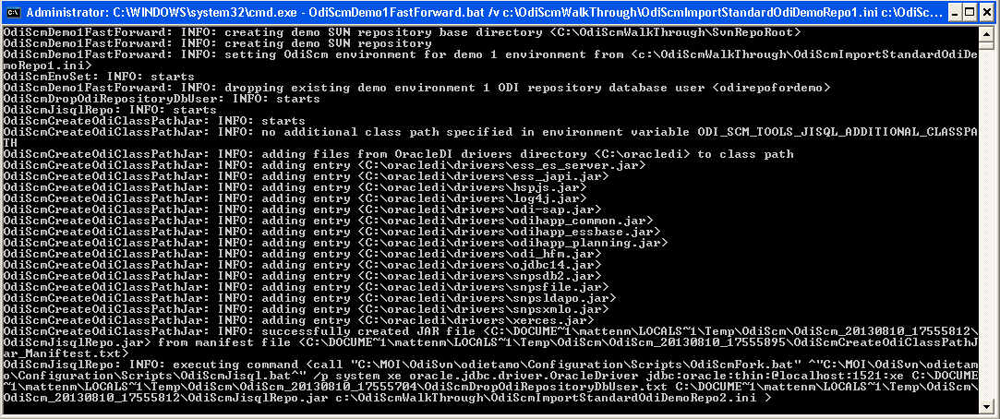
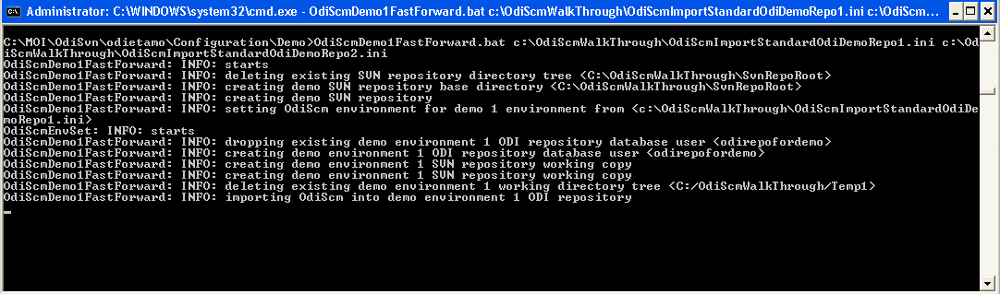

Demonstration 1 - ODI repository ping pong - fast forward
=========================================================

Overview
--------

If you haven't already worked through the *Demonstration 1 - ODI Repository Ping Pong - Step By Step* document then do so before working through this version.

In fact, in this demo, there's really not much for you *to* work through. We're just going to use the ODI-SCM commands to automate the process followed in *Demonstration 1 - ODI Repository Ping Pong - Step By Step*.

Edit the ODI-SCM configuration INI files for demo environments 1 and 2
----------------------------------------------------------------------

Open the demo environment 1 configuration INI file (C:\OdiScmWalkThrough\OdiScmImportStandardOdiDemoRepo1.ini) in a text editor.

Update the following section entries to *remove* their values:

+-----------------+-----------------------------+
|Section Name     |Entry Name                   |
+=================+=============================+
|Import Controls  |OracleDI Imported Revision   |
+-----------------+-----------------------------+
|                 |Working Copy Revision        |
+-----------------+-----------------------------+

I.e. the section should look like::

	[Import Controls]
	OracleDI Imported Revision=
	Working Copy Revision=

Save the file.

Open the demo environment 2 configuration INI file (C:\OdiScmWalkThrough\OdiScmImportStandardOdiDemoRepo2.ini) in a text editor and make the same changes to remove the values. Save the file.

Run the demo
------------

From the command prompt::

	"%ODI_SCM_HOME%\Configuration\Demo\OdiScmDemo1FastForward" /v C:\OdiScmWalkThrough\OdiScmImportStandardOdiDemoRepo1.ini C:\OdiScmWalkThrough\OdiScmImportStandardOdiDemoRepo2.ini C:\OdiScmWalkThrough\OdiScmExportStandardOdiDemo.ini

Sit back and enjoy the output of the ODI-SCM commands!

Note that the ``/v`` (or ``/verbose``) switch causes the command to output additional progress messages.

Without this switch specified, you'd see a much smaller output:

Please take a look inside the ``OdiScmDemo1FastForward.bat`` script for which ODI-SCM commands are used and how they work.

You can run this command line repeatedly as it destroy and recreate the demo environments as needed.