=========================================================
Demonstration 1 - ODI repository ping pong - step by step
=========================================================

Overview
--------

If you haven't already installed/configured the ODI-SCM solution, do that now before coming back to this demo.

This step-by-step demo shows the ODI-SCM solution used to build an ODI repository containing the standard ODI demo, export the demo to a Subversion (SVN) repository, then build a second ODI repository from the SVN respository.
Finally, we make some code changes in the second repository and send the code, via the SVN repository, to the first repository.

We go through the following steps: -

* Setting up additional tools required for the ODI-SCM demo.
* Creating a new Subversion (SVN) repository and creating demo environment 1 working copy.
* Creating demo environment 1 ODI repository and installing the ODI-SCM repository components into it.
* Installing the standard ODI demo into demo environment 1 ODI repository.
* Adding ODI-SCM scenario generation object markers to demo environment 1 ODI repository.
* *Flushing* the standard demo from demo environment 1 ODI repository to the SVN working copy.
* Checking in ODI code from demo environment 1 SVN working copy to the SVN repository.
* Creating demo environment 2.
* Populating demo environment 2 ODI repository from the SVN repository.
* Creating changes in demo environment 2 ODI repository, *flushing* them to the SVN working copy and checking them in to the SVN repository.
* Updating demo environment 1 ODI repository from the SVN repository.

Note: for the highly automated version of this demo, see the *Demonstration 1 - ODI repository ping pong - fast forward* document. This uses more of the ODI-SCM utilities to automate most of the demo, following the initial installation of ODI-SCM and other tools. How exciting! But, we recommend you follow this demo through *first*.

Set up additional tools for the ODI-SCM demo
============================================

Install OracleXE
----------------

Install Oracle Express Edition, from the installer downloadable from::

	http://www.oracle.com/technetwork/products/express-edition/downloads/index.html

Note: If you're running this demo on a Windows 64 bit machine - Oracle state on the download site that OracleXE 'does not work' on 64 bit Windows machines. In fact it does perfectly well for the purposes of this demo!

Set the password of the SYSTEM user to "xe" during the installation.

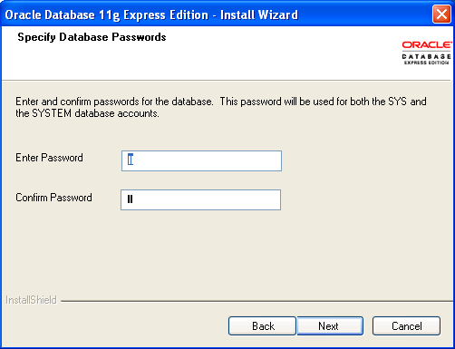

A quick installation guide can be found here: http://bpits.net/how-to-set-up-local-oracle-sql-database-in-3-steps

Note that the OracleXE installation includes an Oracle client.

Install Subversion
------------------

Download Subversion (SVN), and install it, from one of the binary distributions listed at::

	http://subversion.apache.org/packages.html#windows

After installing SVN, you can check that the SVN commands are available. From a new command prompt window enter::

	svn help

The command should be found and display a command help summary.

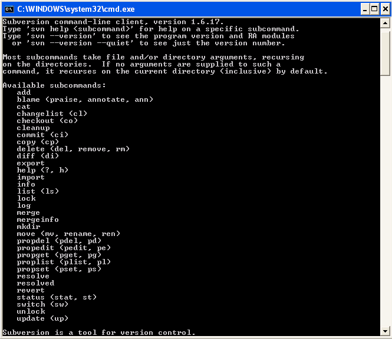

Create a new empty Subversion repository and demo environment 1 working copy
============================================================================

Create demo base directory
--------------------------

From the command prompt, create the demo base directory::

	md C:\OdiScmWalkThrough

Create a new SVN repository
---------------------------

From the command prompt::

	svnadmin create C:\OdiScmWalkThrough\SvnRepoRoot

Create a new SVN working copy for demo environment 1
----------------------------------------------------

From the command prompt, first create the working copy root directory::

	md C:\OdiScmWalkThrough\Repo1WorkingCopy

Then create a working copy in the new directory::

	svn checkout file:///C:/OdiScmWalkThrough/SvnRepoRoot C:\OdiScmWalkThrough\Repo1WorkingCopy

.. figure:: imgs/8_2_0.png

Create a new working directory for demo environment 1
-----------------------------------------------------

From the command prompt, create a working directory::

	md C:\OdiScmWalkThrough\Temp1

Create demo environment 1 linked master and work repository
===========================================================

Create a new Oracle user
------------------------

Connect to the database as the SYSTEM user (this user can create new users) using SQL*Plus::

	sqlplus system/xe@localhost:1521/xe

Then::

	CREATE USER odirepofordemo IDENTIFIED BY odirepofordemo DEFAULT TABLESPACE users TEMPORARY TABLESPACE temp;
	GRANT CONNECT, RESOURCE, CREATE DATABASE LINK TO odirepofordemo;

Create demo environment 1 master repository
-------------------------------------------

Create a new empty Master Repository using the repository creation wizard. 

Specify the new master repository details: -

+----------------------+-----------------------------------+
|Attribute             |Value                              |
+======================+===================================+
|Technology Type       |Oracle                             |
+----------------------+-----------------------------------+
|JDBC Driver           |oracle.jdbc.driver.OracleDriver    |
+----------------------+-----------------------------------+
|JDBC URL              |jdbc.oracle.thin:@localhost:1521:xe|
+----------------------+-----------------------------------+
|User Name             |odirepofordemo                     |
+----------------------+-----------------------------------+
|Password              |odirepofordemo                     |
+----------------------+-----------------------------------+
|Master Repository ID  |100                                |
+----------------------+-----------------------------------+

Using ODI 10g
~~~~~~~~~~~~~

If you're using ODI 10g then start the wizard by starting running the Master Repository creation wizard by starting the batch script::

	<Your OracleDI home directory>\bin\repcreate.bat

.. figure:: imgs/4_2.png

Wait for the wizard to create the Master Repository. Then click OK to exit the wizard when prompted.

.. figure:: imgs/4_2_2.png

Create a new master repository connection profile for the new Master Repository from Topology Manager (topology.bat). Use the new SUPERVISOR user (password "SUNOPSIS").

.. figure:: imgs/4_2_3.png

Use the test function (with the Local Agent) to check the entered details.

.. figure:: imgs/4_2_4.png

Using ODI 11g
~~~~~~~~~~~~~

If you're using ODI 11g then start the wizard from the ODI Studio's File menu. I.e.::

	File -> New... -> Master Repository Creation Wizard

Note that the ODI 11g Master Repository creation wizard requires a login, to the database, with DBA privileges, such as the SYSTEM user. Specify the value 100 for the Master Repository internal ID. Wait for the wizard to create the master repository:

.. figure:: imgs/4_2_5.png

Specify the password "SUNOPSIS" for the SUPERVISOR user and click "Next >".

.. figure:: imgs/4_2_6.png

Select Internal Password Storage and click "Next >".

.. figure:: imgs/4_2_7.png

.. figure:: imgs/4_2_9.png

Then click OK to exit the wizard when prompted.

.. figure:: imgs/4_2_8.png

Create a new master repository connection profile for the new master repository from the "Connect To Repository..." icon in the ODI Studio UI. Use the SUPERVISOR user (password "SUNOPSIS").

.. figure:: imgs/4_2_10.png

Use the test function (with the Local Agent) to check the entered details.

.. figure:: imgs/4_2_11.png

Create demo environment 1 Work Repository in the Master Repository DB schema
----------------------------------------------------------------------------

Use the new connection profile to connect to the new Master Repository and view the ODI Topology definitions:

* ODI 10g: start the Toplogy Manager UI using "topology.bat".
* ODI 11g: start the Toplogy Navigator using the ODI Studio UI.

Create a new work *development* type repository from the Repositories tree view by right-clicking on the "Work Repositories" node then clicking "Insert Work Repository". 

Specify the new work repository connection details: -

+--------------------+-----------------------------------+
|Attribute           |Value                              |
+====================+===================================+
|Work Repository Name|WORKREP                            |
+--------------------+-----------------------------------+
|Technology Type     |Oracle                             |
+--------------------+-----------------------------------+
|JDBC Driver         |oracle.jdbc.driver.OracleDriver    |
+--------------------+-----------------------------------+
|JDBC URL            |jdbc.oracle.thin:@localhost:1521:xe|
+--------------------+-----------------------------------+
|User Name           |odirepofordemo                     |
+--------------------+-----------------------------------+
|Password            |odirepofordemo                     |
+--------------------+-----------------------------------+
|Work Repository ID  |100                                |
+--------------------+-----------------------------------+

*The ODI 10g UI is shown in the following figures.*

Complete the "Definition" tab for the new work repository connection. Note that we're creating a Work Repository in the same schema/user as the Master Repository:

.. figure:: imgs/4_3_1.png

Then complete the JDBC tab:

.. figure:: imgs/4_3_2.png

Use the "Test" function, using the Local agent, to test the connection details for the work repository:

.. figure:: imgs/4_3_3.png

Then enter the details of the new work repository. Click OK and wait for a few seconds for the new work repository structure to be created:

.. figure:: imgs/4_3_4.png

Open the Designer UI from the toolbar icon in Topology Manager and create a new work repository connection profile for the new work repository:

.. figure:: imgs/4_3_5.png

Use the "Test" function, using the Local agent, to test the connection details for the work repository:

.. figure:: imgs/4_3_6.png

You can now connect to the new, empty, work repository. Have a look. It’s empty!

Install the ODI-SCM repository components into demo environment 1 ODI repository
================================================================================

Set the ODI-SCM environment for demo environment 1
--------------------------------------------------

From the command prompt (cmd.exe), copy the pre-defined demo environment 1 ODI-SCM configuration INI file to the demo directory::

	copy "%ODI_SCM_HOME%\Configuration\Demo\OdiScmImportStandardOdiDemoRepo1.ini" C:\OdiScmWalkThrough\

Open the copied file (``C:\OdiScmWalkThrough\Repo1WorkingCopy\OdiScmImportStandardOdiDemoRepo1.ini``) in a text editor and edit the following entries for the version and installation location of ODI that you're using, and for the location of your Oracle client software.

+---------+-------------------+---------------------------------------------------------------------------------------------------------+
|Section  | Key               | Description                                                                                             |
+=========+===================+=========================================================================================================+
|OracleDI | Home              | Home directory of your ODI installation.                                                                |
|         |                   +---------------------------------------------------------------------------------------------------------+
|         |                   | This is the directory containing the *bin* directory that contains the 'startcmd.bat' script.           |
|         |                   |                                                                                                         |
|         |                   | E.g. for ODI 10g, the default installation directory might be:                                          |
|         |                   |                                                                                                         |
|         |                   | ``C:\OraHome_1\oracledi``                                                                               |
|         |                   |                                                                                                         |
|         |                   | E.g. for ODI 11g, the default installation directory might be:                                          |
|         |                   |                                                                                                         |
|         |                   | ``C:\oracle\product\11.1.1\Oracle_ODI_1\oracledi\agent``                                                |
|         +-------------------+---------------------------------------------------------------------------------------------------------+
|         | Version           | The version of ODI you're running.                                                                      |
|         +-------------------+---------------------------------------------------------------------------------------------------------+
|         | Java Home         | The home directory of the JVM that you're using with ODI.                                               |
|         +-------------------+---------------------------------------------------------------------------------------------------------+
|         | Common            | Set to empty for ODI 10g.                                                                               |
|         |                   |                                                                                                         |
|         |                   | For ODI 11g set to the path of the 'oracledi.common' directory for your ODI installation.               |
|         |                   |                                                                                                         |
|         |                   | E.g. to ``C:\oracle\product\11.1.1\Oracle_ODI_1\oracledi.common``.                                      |
|         +-------------------+---------------------------------------------------------------------------------------------------------+
|         | SDK               | Set to empty for ODI 10g.                                                                               |
|         |                   |                                                                                                         |
|         |                   | For ODI 11g set to the path of the 'oracledi.sdk' directory for your ODI installation.                  |
|         |                   |                                                                                                         |
|         |                   | E.g. to ``C:\oracle\product\11.1.1\Oracle_ODI_1\oracledi.sdk``.                                         |
+---------+-------------------+---------------------------------------------------------------------------------------------------------+
|Tools    | Oracle Home       | Home directory of your Oracle client installation.                                                      |
|         |                   |                                                                                                         |
|         |                   | This is the directory containing the 'bin' directory that contains the 'exp.exe' and 'imp.exe' binaries.|
|         |                   |                                                                                                         |
|         |                   | E.g. set this to ``C:\oraclexe\app\oracle\product\11.2.0\server``.                                      |
|         +-------------------+---------------------------------------------------------------------------------------------------------+
|         | Jisql Java Home   | The home directory of the JVM that you're using with Jisql.                                             |
|         |                   |                                                                                                         |
|         |                   | E.g. set this to ``C:\Java\jdk1.6.0_45``.                                                               |
+---------+-------------------+---------------------------------------------------------------------------------------------------------+

Save the file and close the text editor.

Import the ODI-SCM repository components
----------------------------------------

First, tell ODI-SCM to use the new configuration INI file. From the command prompt::

	set ODI_SCM_INI=C:\OdiScmWalkThrough\OdiScmImportStandardOdiDemoRepo1.ini

Set the environment from the configuration INI file. From the command prompt::

	call OdiScmEnvSet

Run the following command to import the ODI code components of ODI-SCM into the new repository::

	OdiScmImportOdiScm ExportPrimeLast

.. figure:: imgs/5_3_0.png

Refresh the Projects and Models views in the ODI Designer UI, and the Logical Architecture and Physical Architecture view in the ODI Topology UI, and the ODI-SCM project, and supporting Topology items.

Import the standard ODI demo repository into demo environment 1 ODI repository
==============================================================================

Run the following command from the command prompt::

    "%ODI_SCM_HOME%\Configuration\Demo\OdiScmImportOracleDIDemo"

Refresh the Projects and Models views in the ODI Designer UI, and the Logical Architecture and Physical Architecture view in the ODI Topology UI, and the standard ODI demo material will now be visible.
 
Add ODI-SCM custom markers to demo environment 1 ODI repository
===============================================================

Create new Marker Group and Marker in Demo project
--------------------------------------------------

Create a new Marker Group, in the Demo project, with the following details: -

================== =======================
Field              Value
================== =======================
Marker Group Name  OdiScm
Marker Group Code  ODISCM
Marker Name        Has Scenario
Marker Code        HAS_SCENARIO
================== =======================

.. figure:: imgs/7_1_0.png

You can choose the other field values (e.g. icon, order, position, etc) yourself.

Apply new Marker to objects in the Demo project
-----------------------------------------------

.. figure:: imgs/7_2_0.png

Apply the new *Has Scenario* marker to each and every *Interface* in the *Sales Administration* folder in the Demo project. Leave the procedure *Delete Targets* for now.
Note that in this figure *Display markers and memo flags* is turned on in the ODI user parameters.

These markers will cause scenarios to be generated for these objects later on in the demo.

*Flush* the standard ODI demo from demo environment 1 ODI repository to demo environment 1 SVN working copy
===========================================================================================================

From within the Designer UI navigate to::

    Projects -> ODI-SCM -> COMMON -> Packages -> OSFLUSH_REPOSITORY -> Scenarios

Right-click on the Scenario -> Execute, selecting the *Global* context and the *Local* agent.

.. figure:: imgs/9_1_0.png
 
Monitor the session in the Operator UI:

.. figure:: imgs/9_1_1.png

Note that if you examine the logs closely, you'll see two steps that issued warnings - the step *Create Flush Control* in both the OSUTL_FLUSH_MASTER_REPOSITORY and OSUTL_FLUSH_WORK_REPOSITORY. The *flush control* tables were created by the ODI-SCM demo import script. It’s safe to ignore this warning.

Check in ODI code from demo environment 1 SVN working copy to the SVN repository
====================================================================================

Check in the exported code to the SVN repository
------------------------------------------------

From the command prompt change directory to the demo environment 1 SVN working copy directory::

	cd C:\OdiScmWalkThrough\Repo1WorkingCopy\SvnRepoRoot

Examine the status of the working copy::

	svn status

.. figure:: imgs/9_2_0.png

You should see files prefixed with "?". These are files that are not known to the SVN working copy.

Next, pend all files, created by the ODI-SCM export mechanism, to be added to the SVN repository::

    svn add * –-force

.. figure:: imgs/9_2_1.png

(Note that "-—force" is used to add all files in all subdirectories).

Again, examine the status of the working copy::

	svn status

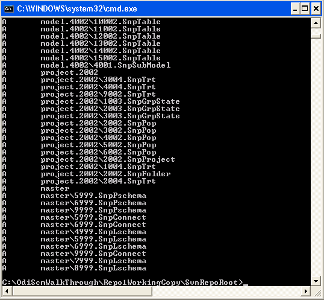

The *added* files are shown. Note the first column containing ``A`` (Added).

Finally commit the files to the SVN repository::

	svn commit . –m "Initial check in of the standard ODI demo"

.. figure:: imgs/9_2_2.png

Create demo environment 2
=========================

We now use the processes used to create demo environment 1 to create demo environment 2, changing details where necessary.

Create demo environment 2 SVN working copy
------------------------------------------

From the command prompt, first create the working copy root directory::

	md C:\OdiScmWalkThrough\Repo2WorkingCopy

Then create an *empty* working copy in the new directory::

	svn checkout file:///C:/OdiScmWalkThrough/SvnRepoRoot C:\OdiScmWalkThrough\Repo2WorkingCopy --revision 0

Note that we create an *empty* working copy. I.e. a working copy based on revision 0 (before any files were added) of the SVN repository. We will use this, later in the demo, to generate a set of files to be imported into the demo environment 2 ODI repository.

Create a new working directory for demo environment 2
-----------------------------------------------------

From the command prompt, create a working directory::

	md C:\OdiScmWalkThrough\Temp2

Create demo environment 2 ODI repository
----------------------------------------

Create a second new Oracle user using the same process as the first, but with a user name and password of ``odirepofordemo2``::

Connect to the database as the SYSTEM user (this user can create new users) using SQL*Plus::

	sqlplus system/xe@localhost:1521/xe

Then::

	CREATE USER odirepofordemo2 IDENTIFIED BY odirepofordemo2 DEFAULT TABLESPACE users TEMPORARY TABLESPACE temp;
	GRANT CONNECT, RESOURCE, CREATE DATABASE LINK TO odirepofordemo2;

Create a second master repository in the new ``odirepofordemo2`` schema with the internal ID of *200*. I.e. using details as follows: -

+----------------------+-----------------------------------+
|Attribute             |Value                              |
+======================+===================================+
|Technology Type       |Oracle                             |
+----------------------+-----------------------------------+
|JDBC Driver           |oracle.jdbc.driver.OracleDriver    |
+----------------------+-----------------------------------+
|JDBC URL              |jdbc.oracle.thin:@localhost:1521:xe|
+----------------------+-----------------------------------+
|User Name             |odirepofordemo2                    |
+----------------------+-----------------------------------+
|Password              |odirepofordemo2                    |
+----------------------+-----------------------------------+
|Master Repository ID  |200                                |
+----------------------+-----------------------------------+

Create a second work repository, with name WORKREP, in the new schema (again, the same schema as the master repository) with the internal ID of *200*. I.e. using details as follows: -

+--------------------+-----------------------------------+
|Attribute           |Value                              |
+====================+===================================+
|Work Repository Name|WORKREP                            |
+--------------------+-----------------------------------+
|Technology Type     |Oracle                             |
+--------------------+-----------------------------------+
|JDBC Driver         |oracle.jdbc.driver.OracleDriver    |
+--------------------+-----------------------------------+
|JDBC URL            |jdbc.oracle.thin:@localhost:1521:xe|
+--------------------+-----------------------------------+
|User Name           |odirepofordemo2                    |
+--------------------+-----------------------------------+
|Password            |odirepofordemo2                    |
+--------------------+-----------------------------------+
|Work Repository ID  |200                                |
+--------------------+-----------------------------------+

Create a login profile for the new Master and Work repository. Log into the Work repository. It's empty.

Install the ODI-SCM repository components into demo environment 2 ODI repository
--------------------------------------------------------------------------------

Set the ODI-SCM environment for demo environment 2
~~~~~~~~~~~~~~~~~~~~~~~~~~~~~~~~~~~~~~~~~~~~~~~~~~

From the command prompt (cmd.exe), copy the pre-defined demo environment 2 ODI-SCM configuration INI file to the demo directory::

	copy "%ODI_SCM_HOME%\Configuration\Demo\OdiScmImportStandardOdiDemoRepo2.ini" C:\OdiScmWalkThrough\

Open the copied file (``C:\OdiScmWalkThrough\OdiScmImportStandardOdiDemoRepo2.ini``) in a text editor and edit the same entries as for the configuration INI file for demo environment 1.

Note that the values given to the entries, for demo environment 2, can be exactly the same as for demo environment 1. You *could* have separate installations of ODI, Oracle client, Jisql, etc, if you wish to, but there's certainly no need. You certainly *should* be using the same version ODI against the same code base.

Save the file and close the text editor.

Import the ODI-SCM repository components into demo environment 2 ODI repository
~~~~~~~~~~~~~~~~~~~~~~~~~~~~~~~~~~~~~~~~~~~~~~~~~~~~~~~~~~~~~~~~~~~~~~~~~~~~~~~

First, tell ODI-SCM to use the new configuration INI file. From the command prompt::

	set ODI_SCM_INI=C:\OdiScmWalkThrough\OdiScmImportStandardOdiDemoRepo2.ini

Set the environment from the configuration INI file. From the command prompt::

	call OdiScmEnvSet

Run the following command to import the ODI code components of ODI-SCM into the new repository::

	OdiScmImportOdiScm ExportPrimeLast

Refresh the Projects and Models views in the ODI Designer UI, and the Logical Architecture and Physical Architecture view in the ODI Topology UI, and the ODI-SCM project, and supporting Topology items.

Populate demo environment 2 ODI repository from the SVN repository
==================================================================

Next, we update the empty demo environment 2 SVN working copy from the SVN repository, and at the same time, automatically generate scripts to import the downloaded code into the demo environment 2 ODI repository.

From the command prompt::

	OdiScmGet.bat

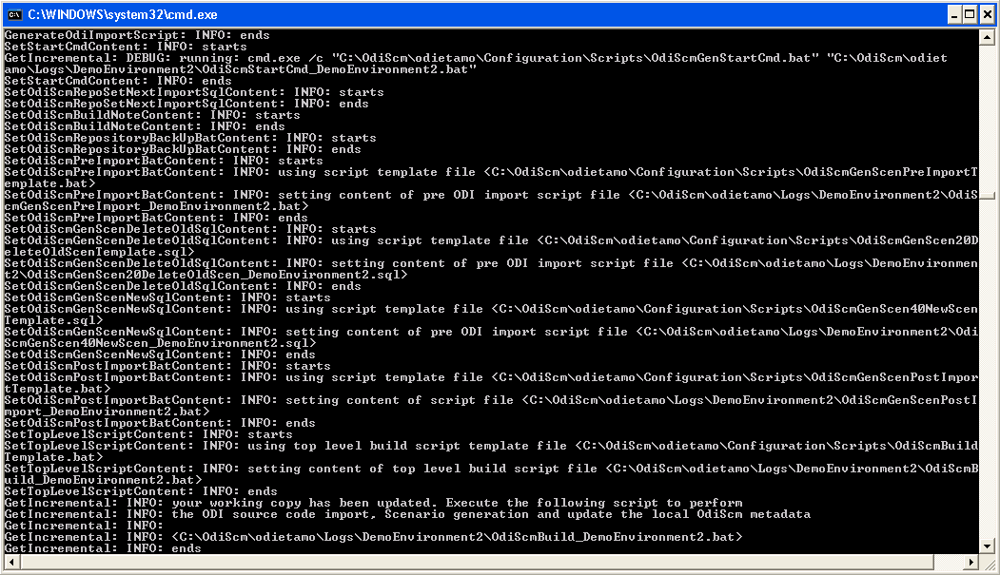

Examine the working copy (``C:\OdiScmWalkThrough\Repo2WorkingCopy\SvnRepoRoot``). You'll find exactly the same set of files as we checked in from the demo environment 1 working copy, earlier.

Then run the generated script to import the changes to the working copy into the ODI repository. From the command prompt::

	"%ODI_SCM_HOME%\Logs\DemoEnvironment2\OdiScmBuild_DemoEnvironment2"

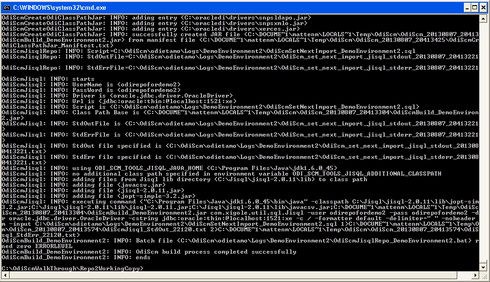

The generated script performs the following process:

1.	Back up the ODI repository by creating an Oracle export backup of the repository schema.
2.	Import ODI source object files, added or updated in the SVN working copy by the OdiScmGet process, into the ODI repository.
3.	Regenerate Scenarios in the ODI repository for all Packages/Interfaces/Procedures, imported by the import process, where they have the custom ODI-SCM *Has Scenario* marker.
4.	Validate the ODI repository internal ID allocation/tracking metadata.
5.	Update the SCM revision number tracking in the ODI-SCM configuration INI file and ODI-SCM ODI repository metadata.

Refresh the Projects and Models views in the ODI Designer UI, and the Logical Architecture and Physical Architecture view in the ODI Topology UI, and the standard ODI demo material will now be visible.

Note that the objects, marked with the custom ODI-SCM *Has Scenario* marker (all the interfaces, but not the procedure), in the demo environment 2 ODI repository, will have scenarios. But, in the demo environment 1 ODI repository the scenarios are not present. Hence the code in the SVN repository also does contain scenarios.

This shows the purpose of these markers - to identify those source objects that should have a Scenario.

The ODI-SCM solution will generate scenarios for these objects when importing code from an SCM repository. Scenarios are not stored in the SCM repository because ODI does not consistently consistently generate Scenarios (the order of elements Scenarios tends to differ) from a consistent set of source objects, and we do not want a variation in a Scenario to be considered a change to a source object being controlled by the SCM repository.

Create new objects in demo environment 2 ODI repository
=======================================================

Right, let's change some objects are create some new ODI objects in demo environment 2:

Change procedure Delete Targets
-------------------------------

Open the procedure *Delete Targets* and add some new text to the end of the Definition. E.g. from::

	Delete the target tables (evaluation purpose only)

To::

	Delete the target tables (evaluation purpose only)

	==================================
	Added the OdiScm automation marker
	==================================

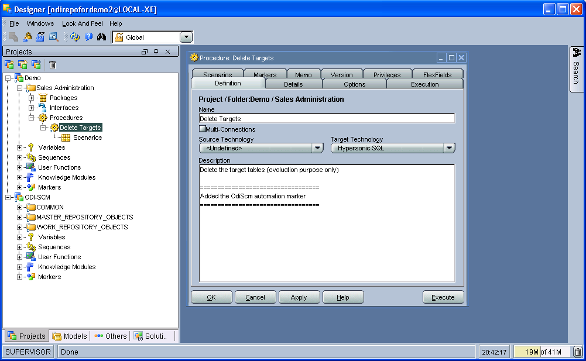

Also, add the ODI-SCM *Has Scenario* marker to the procedure:

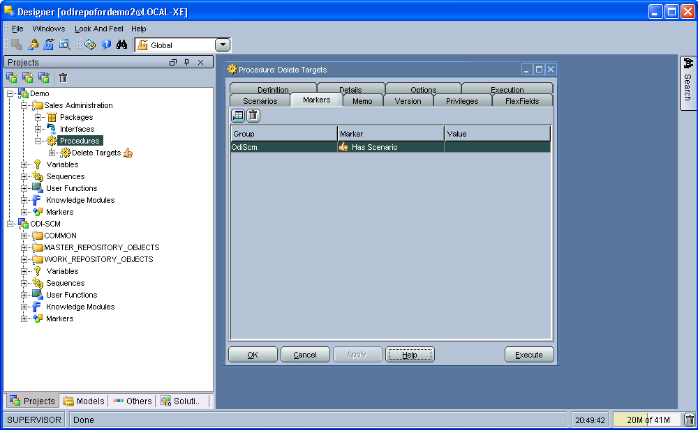

Create a new project and package
--------------------------------

Create a new project with the following properties: -

============== =========================
Attribute      Value
============== =========================
Project Name   Demo2
Project Code   DEMO2
============== =========================

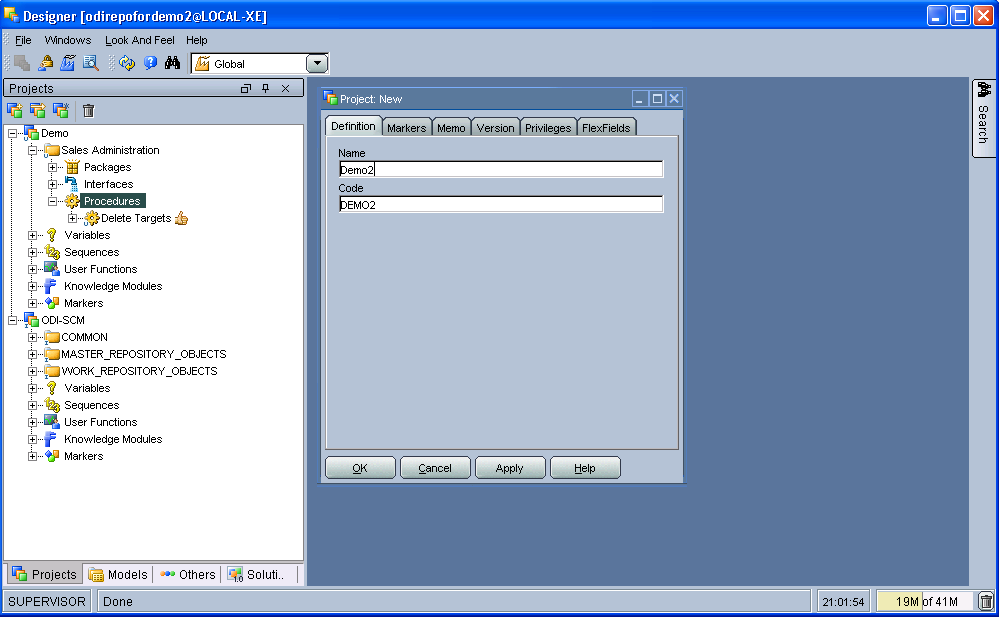

Then, inside the default project folder *First Folder* create a new package named *Demo2 Package*.

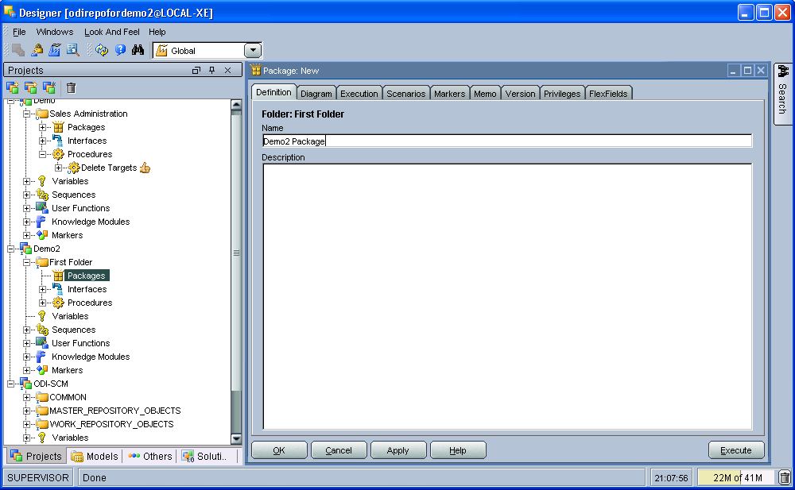

Flush the new and changed code to the SVN working copy
------------------------------------------------------

In addition, to using the ODI-SCM Designer objects, we can also flush additions and changes made in the ODI repository using an ODI-SCM command line command. From the command prompt::

	OdiScmFlushRepository

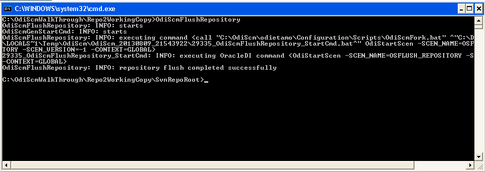

You can see the job logs in the ODI Operator UI: -

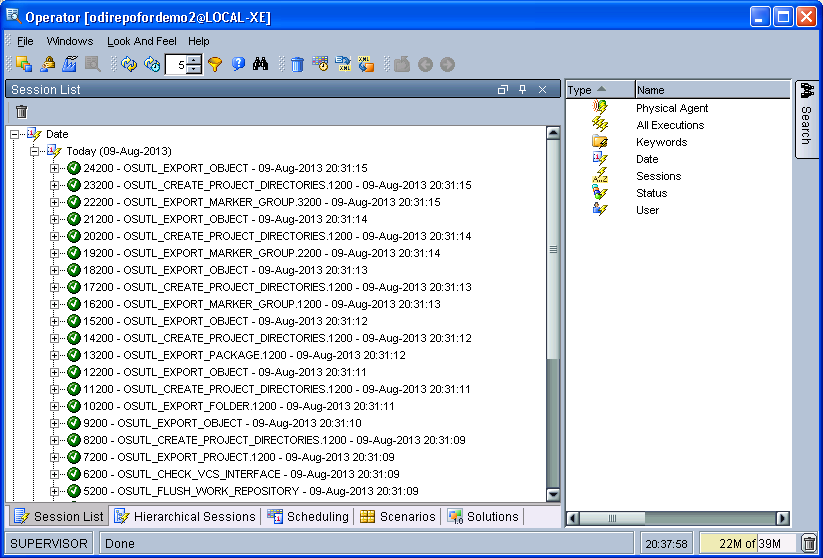

Examine the SVN working copy. You'll find a new directory containing files for the new the project container object, the default project folder, the package we created, and the default marker groups created by ODI. These files have are not yet being tracked by the SVN working copy.

Also, if you examine the ODI job logs, in the ODI Operator UI, you'll find that only the additions and changes applied to the ODI repository, via the Designer UI, *since* we populated the ODI repository from the SVN repository, were exported by the *flush* operation. The *flush* operation is *incremental*. In other words, it exports object that have been created or changed since the previous *flush* operation or installation of the ODI-SCM repository components.

Next, add the newly exported files to, then check the status of, the SVN working copy. From the command prompt::

	cd C:\OdiScmWalkThrough\Repo2WorkingCopy\SvnRepoRoot
	svn add . --force
	svn status

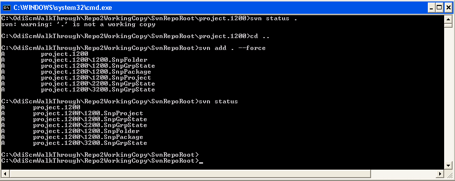

Finally, check in the pended working copy changes to the SVN repository. From the command prompt::

	svn commit . –m "Adding some new stuff"

*Update* demo environment 1 ODI repository from the SVN repository
==================================================================

We end this demo by switching back to demo environment 1 and updating the ODI repository from the work created in demo environment 2.

First, tell ODI-SCM to use the new configuration INI file. From the command prompt::

	set ODI_SCM_INI=C:\OdiScmWalkThrough\OdiScmImportStandardOdiDemoRepo1.ini

Set the environment from the configuration INI file. From the command prompt::

	call OdiScmEnvSet

Get the updates from the SVN repository and generate the ODI import scripts. From the command prompt::

	OdiScmGet

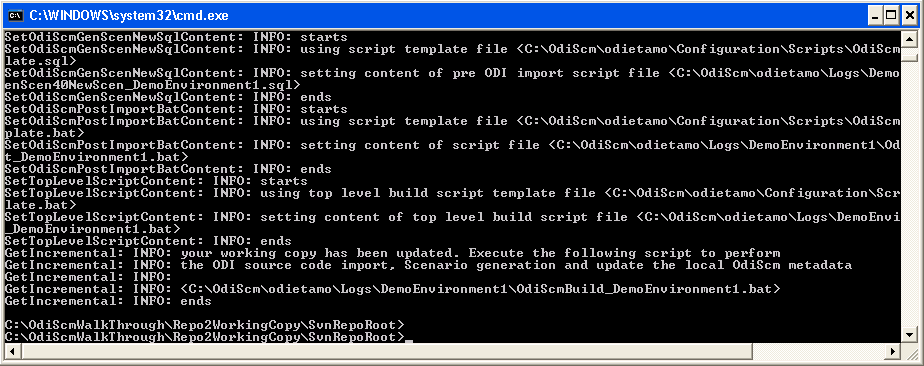

Execute the generated script. From the command prompt::

	C:\OdiScm\odietamo\Logs\DemoEnvironment1\OdiScmBuild_DemoEnvironment1.bat

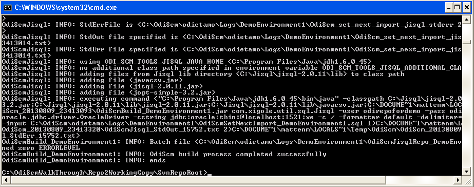

Refresh the Projects view in the ODI Designer UI and the new and changed objects will now be visible.

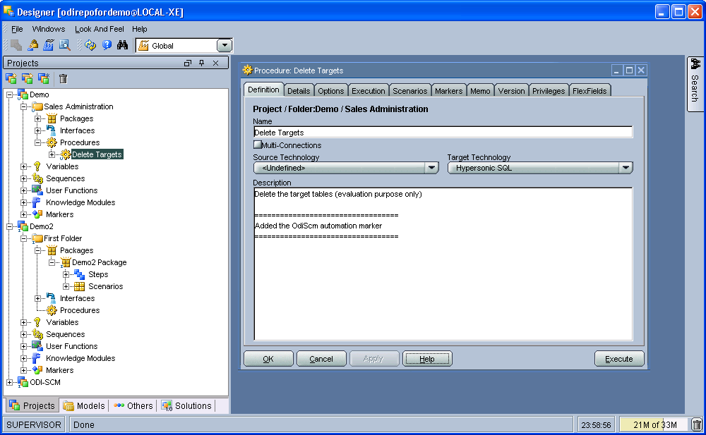