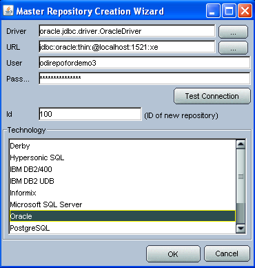
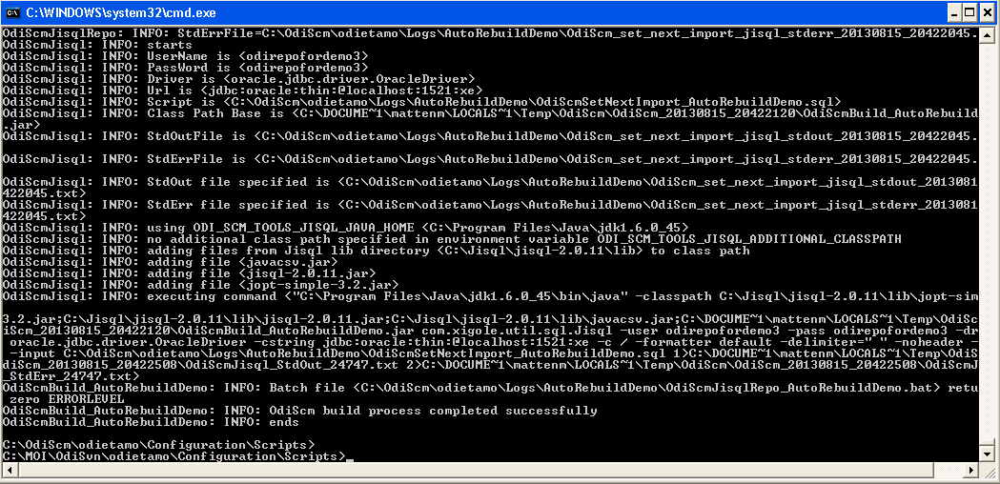
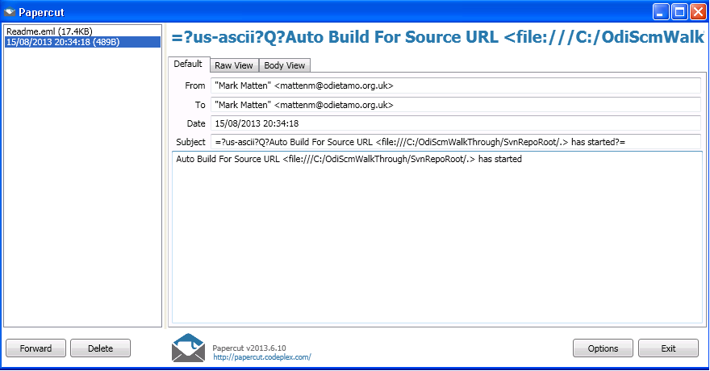

Continuous, automated, ODI repository full rebuilds
===================================================

Overview
--------

We'll be building upon the output of demo 1 (or demo 2), so if you haven't already run through demo 1 (or demo 2), do that now before coming back to this demo.

This demo shows the ODI-SCM solution used to automatically destroy and rebuild an ODI repository from the SCM system. 
We use the SVN repository that we created in demo 1 as the source SCM system and create a new SVN working copy from it. We then destroy the ODI repository 

In a later demo we'll show this feature, as well an incremental build, being triggered by a process that monitors the SCM system for changes.

Why would anyone want to do this?

	**To find integrity issues in your ODI code base as early as you can.**

Setting Up Additional Tools For This Demo
-----------------------------------------

PaperCut
~~~~~~~~

PaperCut is a simple development utility that you can use to show emails being sent, via SMTP, by your application. It does not relay the messages. It just allows you to just see what is being sent the the SMTP service.

Download the application from http://papercut.codeplex.com/. Then unpack the ZIP file contents to a new directory.

Start the application by double clicking on the ``papercut.exe`` executable.

.. figure:: imgs/30_10_10.png

Note that the default configuration for PaperCut is for it to listen on TCP port 25 (the standard SMTP server TCP port).

Create The Demo Configuration (INI) File
----------------------------------------

Copy of the pre-configured demo INI file ``OdiScmAutoRebuildDemo.ini`` to demo base directory. From the command prompt::

	copy "%ODI_SCM_HOME%\Configuration\Demo\Demo3\OdiScmAutoRebuildDemo.ini" C:\OdiScmWalkThrough\

This demo INI file is pre-configured for ODI 11g.

Open the INI file and edit the same entries in the ``[OracleDI]`` and ``[Tools]`` sections, as for demo 1, for your environment.

Set The Environment
-------------------

Again, we need to tell ODI-SCM to use the configuration defined in the INI file. From the command prompt::

	set ODI_SCM_INI=C:\OdiScmWalkThrough\OdiScmAutoRebuildDemo.ini
	call OdiScmEnvSet

Create The Oracle User
----------------------

Create a new Oracle user (``odirepofordemo3``), for the new ODI repository, using an ODI-SCM command. From the command prompt::

	OdiScmCreateOdiRepositoryDbUser

.. figure:: imgs/30_20_10.png

Additional Step For ODI 10g Users
---------------------------------

Manually Create The Master and Work Repositories
~~~~~~~~~~~~~~~~~~~~~~~~~~~~~~~~~~~~~~~~~~~~~~~~

If you're using ODI 10g then an extra step is required - creating a base empty Master/Work repository export backup.

This is because we can't use an ODI SDK with ODI 10g to create empty repositories.

Use the values from the INI file and follow the manual process, decribed in Demo 1, to create an empty ODI 10g Master
and Work repository.

Use ``repcreate.bat`` to start the wizard to create the new Master repository. Bbe **sure** to use ``100`` for the ID of the new Master repository.

Then connect to the new Master repository, using the Topology UI, and create a new Work repository, with ID ``100``, named ``WORKREP``, etc.

.. figure:: imgs/30_40_10.png

Then:

.. figure:: imgs/30_50_10.png

Then:

.. figure:: imgs/30_60_10.png

Finally (be **sure** to use ``100`` for the ID of the new Work repository):

.. figure:: imgs/30_70_10.png

Create An Oracle Export Backup of the New Repositories
~~~~~~~~~~~~~~~~~~~~~~~~~~~~~~~~~~~~~~~~~~~~~~~~~~~~~~

Create the Oracle export backup of the new repository pair. From the command prompt::

	cd "%ODI_SCM_TOOLS_ORACLE_HOME%\bin"

Then::

	exp.exe odirepofordemo3/odirepofordemo3@localhost:1521/xe owner=odirepofordemo3 file=C:\OdiScmResources\odirepofordemo3_REPID_100_empty_master_work_%ODI_SCM_ORACLEDI_VERSION%.dmp statistics=none

	.. figure:: imgs/30_80_10.png

The export tool will terminate. Check that the export file has been created. From the command prompt::

	dir C:\OdiScmResources\odirepofordemo3_REPID_100_empty_master_work_*.dmp

.. figure:: imgs/30_90_10.png

A Point About The Repository ID
------------------------------

If you've just skipped the additional step, required for ODI 10g users, then you might not have noticed that, in this demo,
we have are using ``100`` for the new ODI repository's ID.

We have used this ID already for the internal ID of the environment 1 ODI repository in demo 1.
**The reuse of this ID is intentional in this demo.**

This is not a practice that should be followed when creating ODI repositories in which new code or code changes will be made.
If you you'll very likely encounter object internal ID conflicts when integrating the code from the different repositories.
**You really don't want to go there.**

What we're showing by reusing the ID is that ODI-SCM can *safely* import code into a repository that is not the *original*
repository with the same ID. *This operation is now blocked in ODI 11g, by default.*

This ODI-SCM feature allows you to reuse repository IDs to create repositories that are only ever used to import code into,
such as those used for build testing.

It also allows you to destroy and create repositories freely as ODI-SCM is able to re-align ODI object internal ID tracking
metadata after importing code.

This feature is enabled by setting the configuration (INI) file entry ``Export Cleans ImportRep Objects=Yes`` in the
``[Generate]`` section. This causes ODI-SCM to remove the original repository identification from objects when exporting
then. It was enabled in demo 1, hence the ODI object exports files were created without the original repository identifiers.
 
Press The Red Button!
---------------------

Now run the destory/rebuild. From the command prompt::

	OdiScmAutoRebuild

Check the PaperCut window. You should see an email sent from ODI-SCM notifying you of the start of the rebuild process.

When the rebuild process has completed you should see that another notification email has been sent.
This email lets you know that the build process has completed *and* if it succeeded or failed at some point in the process.

.. figure:: imgs/30_120_10.png

What Next?
----------

Well, one good, simple, application would be to run ``OdiScmAutoRebuild`` in an infinite loop.
You get a fresh full build each time it runs and you discover build integrity issues soon after they're introduced to the code base in the SCM system.

Replace PaperCut usage with your enterprise email server, of course!