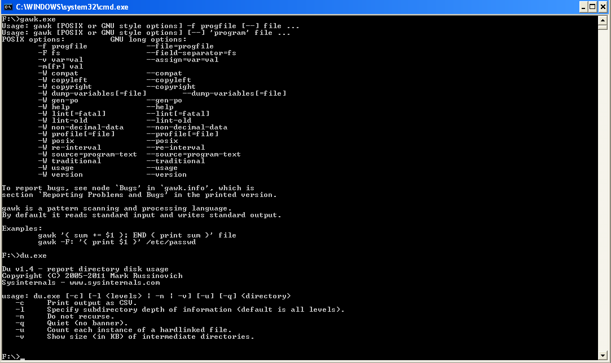
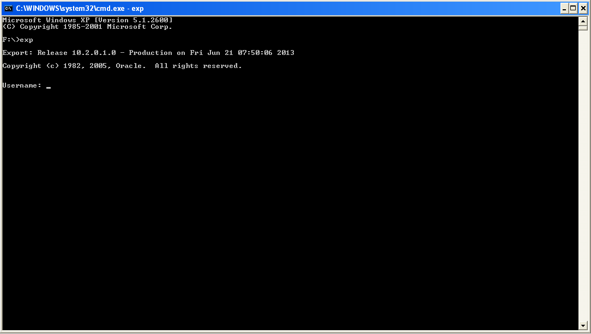
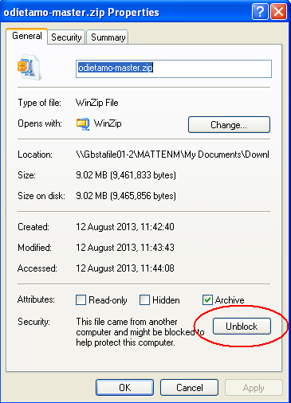

Install and set up the ODI-SCM solution
=======================================

Set up additional tools for the ODI-SCM solution
------------------------------------------------

Install Windows PowerShell
~~~~~~~~~~~~~~~~~~~~~~~~~~

Start a Windows command prompt (cmd.exe), start PowerShell and check the installed version::

    $ powershell -command $host

The required version is 2.0 or later.

If PowerShell is not available then install it from the download at::

   http://support.microsoft.com/kb/968929		(Powershell 2.0)

Start PowerShell. From the command prompt::

	powershell

Then press ``Y`` to confirm.

Exit PowerShell. From the command promt::

	exit

Install UnxUtils
~~~~~~~~~~~~~~~~

Download the collection from::

	http://sourceforge.net/projects/unxutils

Unpack the archive to the new empty directory::

	C:\UnxUtils

and add the subdirectory path::

	C:\UnxUtils\usr\local\wbin

to the *end* of the Windows command path, either in the User or System sections::

	My Computer -> Properties -> Advanced -> Environment Variables

Note that we add this collection to the *end* of the command path so minimise conflicts with Windows commands having the same name as commands from the UnxUtils collection.

Test the availability of the UnxUtils commands by opening a command prompt (cmd.exe) window and running a couple of commands::

	gawk.exe
	du.exe

Both of the above commands should be found and display their options.

Install Jisql
~~~~~~~~~~~~~

Download the latest version of Jisql from::

	http://www.xigole.com/software/jisql/build/jisql-2.0.11.zip

Note that at the time of writing the latest version is 2.0.11. In general the latest version can download from::

	http://www.xigole.com/software/jisql/jisql.jsp

Unpack the archive to an empty directory::

	C:\jisql

So, at the time of writing we have the directory structure::

	C:\jisql
	C:\jisql\jisql-2.0.11
	C:\jisql\jisql-2.0.11\<jisql sub directories>

There is **no** need to add the command directory to the command PATH.

Install Java VM
~~~~~~~~~~~~~~~

The Java VM used by your ODI installation can also be used for the Jisql tool as long as it's a Java 6 or later VM. 

If you're using ODI 10g with a Java 5 VM then you'll need an additional Java 6 VM (either JRE or JDK) installed.

If you're using ODI 11g then you should be using a Java 6 (JRE and JDK) or later VM anyway. A JDK is required for this demo if you're using ODI 11g.

Note that a 32 bit JVM is required. A 32 bit versus 64 bit JVM should be identifiable by opening a command prompt (cmd.exe) window and running the command::

	java -version

Examine the output of this command for the version number of the JVM.

Note that JVMs (we prefer to install JDKs instead of JREs) can be downloaded from Oracle’s website, at::

	http://www.oracle.com/technetwork/java/javasebusiness/downloads/java-archive-downloads-javase6-419409.html	(Java 6)

You can check that a JDK is available, and the version of it, by opening a command prompt (cmd.exe) window and running the command::

	javac -version

If the command was found then a JDK is available. Examine the output of this command for the version number of the JDK.

Oracle Data Integrator
~~~~~~~~~~~~~~~~~~~~~~

This demo has been tested with ODI 10g and 11g.

The specific ODI 10g version is ``ODI 10.1.3.5.6_02``. The base installer (``10.1.3.5.0``) and the patches (``10.1.3.5.6``, ``10.1.3.5.6_01`` and ``10.1.3.5.6_02``) can be downloaded from the Oracle support website.

The specific ODI 11g version is ``ODI 11.1.1.6.4``. The base installer (``11.1.1.6.0``) and the patch (``11.1.1.6.4``) can be downloaded from the Oracle support website.

These ODI versions have proven free *enough* of bugs to work with the ODI-SCM system. Note that we say *free enough* as there are still some bugs in these versions of the import/export API that we have had to work around.

We assume you already know your way around the ODI UIs, directory structure and scripts.

For ODI 10g the usual content of the "oracledi" directory is required.
For ODI 11g the usual content of the *Oracle Home* directory, containing the "oracledi" directory, is required. The ODI SDK must also be installed.

A fairly standard, or *clean*, ``odiparams.bat`` script is required in the installation that you're using as ODI-SCM uses this script to generate its own *startcmd.bat* replacement at run time.

Install Oracle Client
~~~~~~~~~~~~~~~~~~~~~

An Oracle client is required for repository backup operations. A fat client is required rather than the 'instant' client as the ODI-SCM solution requires the 'exp' command line utility in order to create repository backups. The Oracle client software that ODI-SCM will use must be compatible with the Oracle database(s) that host the ODI repositories that you will be using during this demo.

This installation can be tested by running the exp.exe command.

If installed correctly, the imp.exe command will prompt for a database logon user name. Pressing <Control>-C will return you to the command prompt.

Install the ODI-SCM solution
----------------------------

Download the latest ODI-SCM files from GitHub, either by downloading a ZIP file archive of the latest version. The ZIP file can be downloaded from::

	https://github.com/pmsoftware/odietamo/archive/master.zip

*Unblock* the downloaded ZIP file by clicking *Unblock* on the ZIP file *properties dialogue* in Windows Explorer:

Unpack the contents of "odietamo-master.zip" to a new empty directory::

	C:\OdiScm

You should see a directory structure similar to this::

	C:\OdiScm
	C:\OdiScm\odietamo-master
	C:\OdiScm\odietamo-master\Configuration
	C:\OdiScm\odietamo-master\Configuration\bin
	C:\OdiScm\odietamo-master\Configuration\Demo
	C:\OdiScm\odietamo-master\Configuration\Scripts
	C:\OdiScm\odietamo-master\Source
	C:\OdiScm\odietamo-master\docs

Alternatively the OdiScm solution can be downloaded by *cloning* the *master* branch of the GitHub Git repository using Git software. See http://git-scm.com if you're new to GIT. If using this method to download the ODI-SCM files then the directory structure will likely be different. For example the directory ``odietamo-master`` will likely be called ``odietamo`` instead. Adjust, as appropriate, the paths mentioned in the remainder of this demo.

Add a new environment variable ODI_SCM_HOME (My Computer -> Advanced -> Environment Variables) either in the User or System sections. Set the variable value to the path of the new directory into which the ODI-SCM files were unpacked::

	C:\OdiScm\odietamo-master

Next, add the ODI-SCM scripts directory::

	C:\OdiScm\odietamo-master\Configuration\Scripts

to the PATH environment variable ODI_SCM_HOME (My Computer -> Advanced -> Environment Variables) either in the User or System sections.
