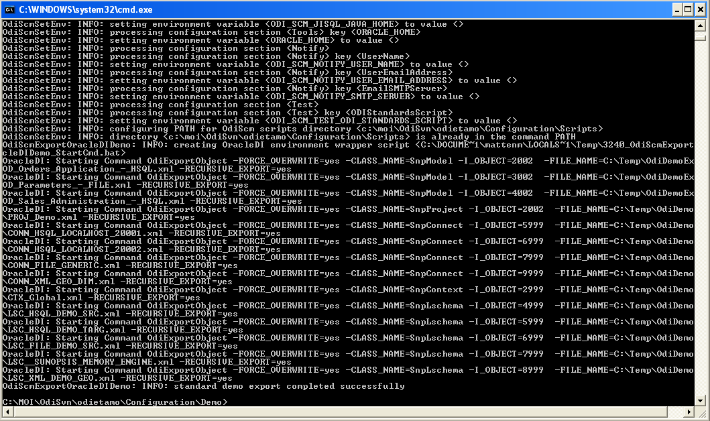
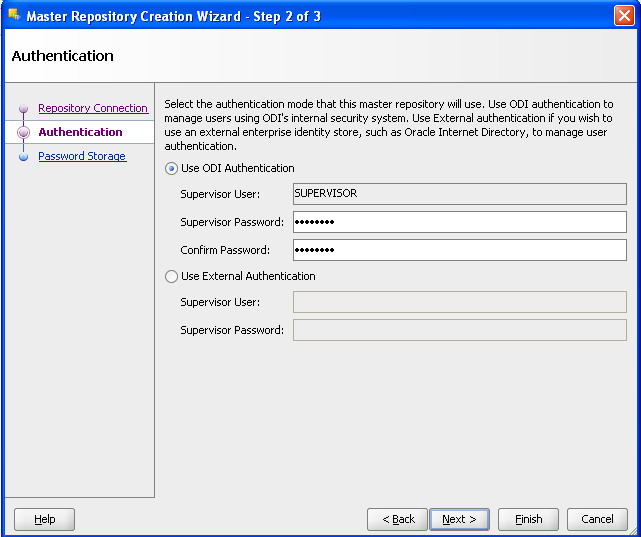
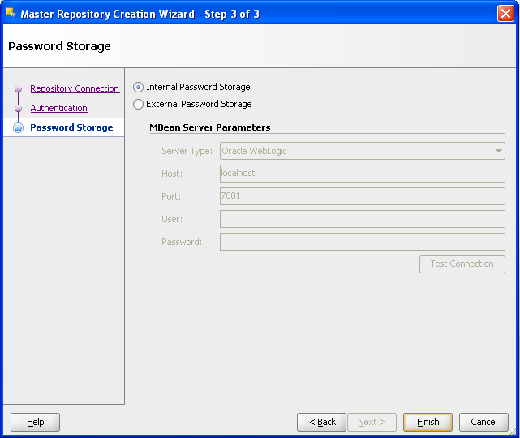
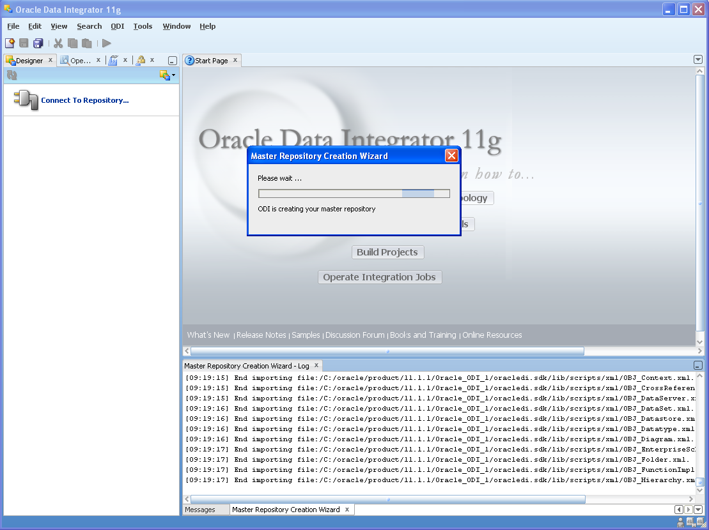
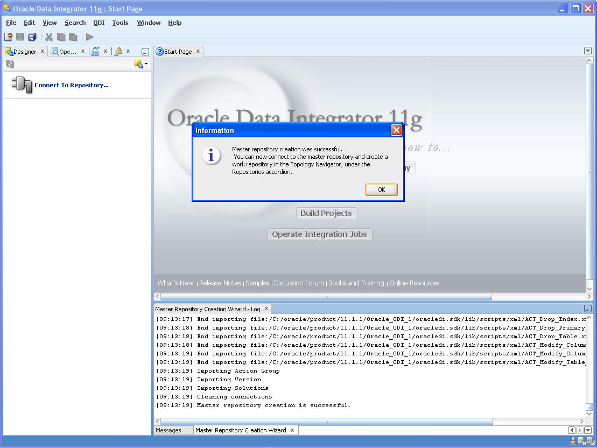
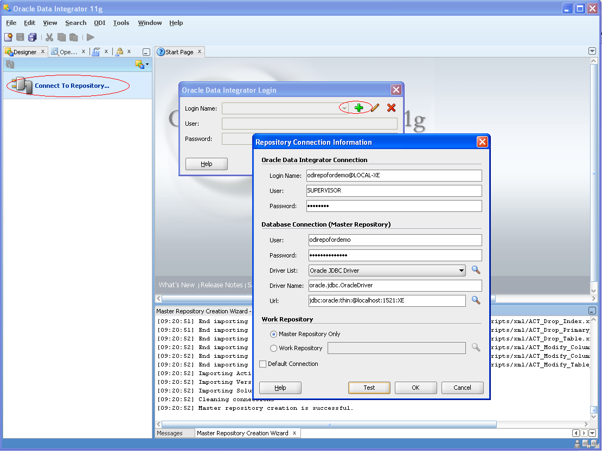
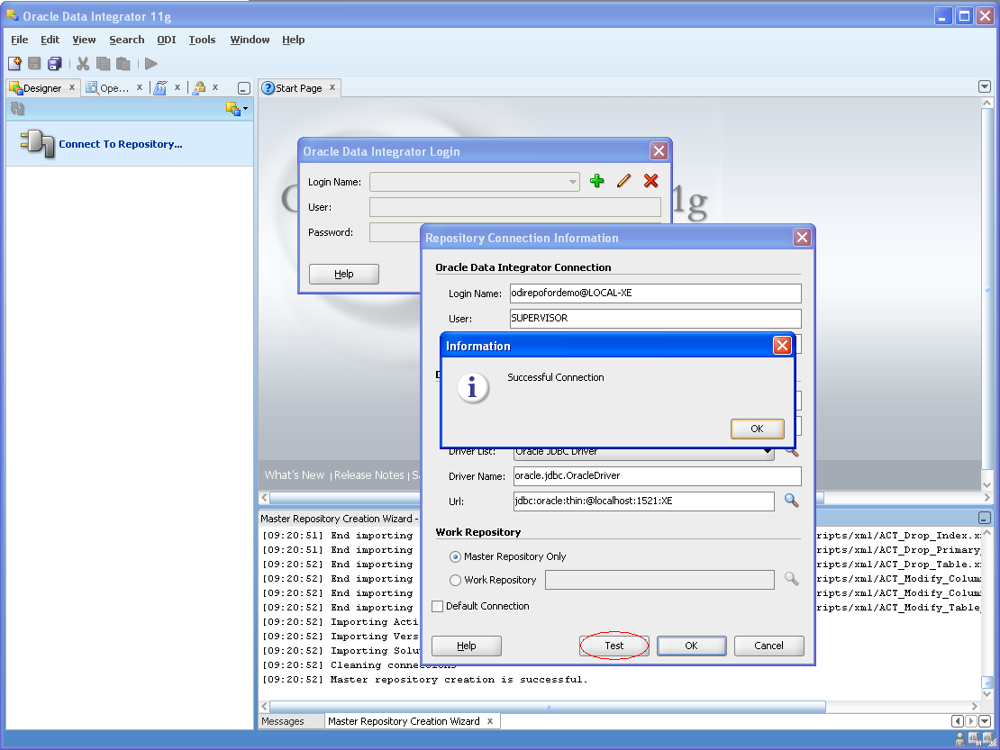
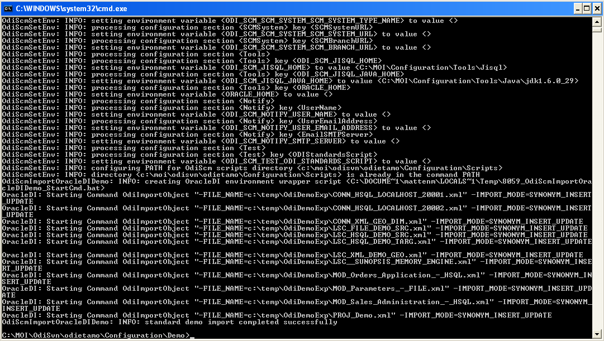

#! -*- coding: utf-8 -*-
 
Walk Through Overview
=====================

This walk through shows the following operations:

* Installing the OdiScm solution.
* Setting up additional tools required for the ODI-SCM solution.
* Start the standard ODI demo repository and export it.
* Creating a new Oracle based repository and installing the standard ODI demo repository.
* Installing the OdiScm repository components.
* Exporting code into a Subversion (SVN) repository working copy and checking code into Subversion.
* Creating a second repository from the code checked into Subversion (SVN).
 
Install the OdiScm solution
============================

Download the latest OdiScm files from GitHub::

	https://github.com/pmsoftware/odietamo/archive/master.zip

Unpack the contents of "odietamo-master.zip" to a new empty directory::

	C:\OdiScm

Add a new environment variable ODI_SCM_HOME (My Computer -> Advanced -> Environment Variables)
either in the User or System sections. Set the variable value to the path of the new directory into which the OdiScm files were unpacked::

	C:\OdiScm\odietamo-master

Install dependencies and configure the environment
==================================================

Install Windows PowerShell
--------------------------

Start a Windows command prompt (cmd.exe), start PowerShell and check the installed version::

    $ powershell -command $host

The required version is 2.0 or later.

If PowerShell is not available then install it from the download at::

   http://support.microsoft.com/kb/968929		(Powershell 2.0)

Oracle Data Integrator
----------------------

This walk through has been tested with ODI 10g and 11g. 

The specific ODI 10g version is ``ODI 10.1.3.5.6_02``. This version is known to support the API functions, used in the OdiScm solution, with no bugs adversely affecting it. The base installer (``10.1.3.5.0``) and the patches (``10.1.3.5.6``, ``10.1.3.5.6_01`` and ``10.1.3.5.6_02``) can be downloaded from the Oracle support website.

The specific ODI 11g version is ``ODI 11.1.1.6.4``. This version is known to support the API functions, used in the OdiScm solution, with no bugs adversely affecting it. The base installer (``11.1.1.6.0``) and the patch (``11.1.1.6.4``) can be downloaded from the Oracle support website.

We assume you already know your way around the UIs, directory structure and scripts!

Install Subversion
------------------

Download Subversion, and install it, from one of the binary distributions listed at::

	http://subversion.apache.org/packages.html#windows

Install UnxUtils
----------------

Download the collection from::

	http://sourceforge.net/projects/unxutils

Unpack the archive to the new empty directory::

	C:\UnxUtils

and add the subdirectory path::

	C:\UnxUtils\usr\local\wbin

to the *end* of the Windows command path, either in the User or System sections::

	My Computer -> Properties -> Advanced -> Environment Variables

Note that we add this collection to the *end* of the command path so minimise conflicts with Windows commands having the same name as commands from the UnxUtils collection.

Test the availability of the UnxUtils commands by opening a command prompt (cmd.exe) window and running a couple of commands::

	gawk.exe
	du.exe

Both of the above commands should be found and display their options.

.. figure:: imgs/3_1_1.png

Install Jisql
-------------

Download the latest version of Jisql from::

	http://www.xigole.com/software/jisql/build/jisql-2.0.11.zip

Note that at the time of writing the latest version is 2.0.11. In general the latest version can download from::

	http://www.xigole.com/software/jisql/jisql.jsp

Unpack the archive to an empty directory::

	C:\jisql

So, at the time of writing we have the directory structure::

	C:\jisql
	C:\jisql\jisql-2.0.11
	C:\jisql\jisql-2.0.11\<jisql sub directories>

There is **no** need to add the command directory to the command PATH.

Install Java
------------

The Java VM used by your ODI installation can also be used for the Jisql tool as long as it's a Java 6 or later VM. If you're using ODI 11g then you'll be using a Java 6 or later VM anyway. If you're using ODI 10g then this can be used with a Java 5 VM so you'll need an additional Java 6 VM (either JRE or JDK) installed.

Note that a 32 bit JVM (JRE or JDK) is required. A 32 bit versus 64 bit JVM should be identifiable by examining the output of the command::

	java -version

Note JVMs (we prefer to download JDKs instead of JREs) can be downloaded from Oracle’s website, at::

	http://www.oracle.com/technetwork/java/javasebusiness/downloads/java-archive-downloads-javase6-419409.html	(Java 6)

Install Oracle Client
---------------------

An Oracle client is required for repository backup operations. A fat client is required rather than the 'instant' client as the OdiScm solution requires the 'exp' command line utility in order to create repository backups. The Oracle client software that OdiScm will use must be compatible with the Oracle database(s) that host the ODI repositories that you will be using.

This installation can be tested by running the exp.exe command.

.. figure:: imgs/3_1_2.png

If installed correctly, the imp.exe command will prompt for a database logon user name. Pressing <Control>-C will return you to the command prompt.

Export the standard ODI demo repository
=======================================

Start the standard ODI demo repository
--------------------------------------

Start a new command prompt (CMD.EXE) window. Change the working directory to the ODI directory containing the "startdemo.bat" batch script::

* For ODI 10g:		cd /d <Your OracleDI home directory>\bin
* For ODI 11g:		cd /d <Your OracleDI home directory>\demo\bin

Start the standard ODI demo environment (ODI repository, source system and target system)::

	startdemo.bat

You should see three console windows open (one for each of the demo repository, source system and target system).

If an error message such as the following is observed::

	The Java Virtual Machine was not found at the following location:
	The ODI_JAVA_HOME environment variable is not defined correctly.
	Please set this variable in odiparams.bat.

Then set JAVA_HOME environment variable in the current prompt window session to the root (home) directory of the Java installation that you will use for your verison of ODI::

	set JAVA_HOME=<path/to/your/JVM/home/directory>

E.g.::

	set JAVA_HOME=C:\Program Files\Java\jdk1.6.0_29

Export the standard ODI demo repository
---------------------------------------

Create a new empty directory for the walk-through::

	mkdir C:\OdiScmWalkThrough

Copy the file "OdiScmExportStandardOdiDemoTemplate.ini" to the walk-through directory::

	copy "%ODI_SCM_HOME%\Configuration\Demo\OdiScmExportStandardOdiDemoTemplate.ini" C:\OdiScmWalkThrough\OdiScmExportStandardOdiDemo.ini

Open the new file in a text editor and edit the following entries: -

* ODI_HOME=<OracleDI home dir>
* ODI_JAVA_HOME=<Java home dir>

Replace <OracleDI home dir> with the path to your ODI home directory. The ODI home directory, for OdiScm, is the directory containing the "bin" directory that contains the "startcmd.bat" and "odiparams.bat" batch script files. 

Replace <Java home dir> with the path to the root of the JVM that you'll be using with ODI. 

E.g.: -

* ODI_HOME=C:\\OracleDI
* ODI_JAVA_HOME=C:\\Java\\jre6

Save the file. Then tell OdiScm to use this file for its configuration file::

	set ODI_SCM_INI=C:\OdiScmWalkThrough\OdiScmExportStandardOdiDemo.ini

Export the standard demo repository to a new directory using the following command. Ensure you include the "/b" switch or the command prompt window will close! Also, ensure you specify either 10G or 11G::

	call "%ODI_SCM_HOME%\Configuration\Demo\OdiScmExportOracleDIDemo.bat" /b C:\OdiScmWalkThrough\StandardDemoRepoExport <10G | 11G>

Note.: -

* The directory path specified will be created by the export script. It must not already exist.
* 10G or 11G must be specified and must correspond to the version of ODI that you're using.

The standard ODI demo repository will then be exported:

Change the working directory to the ODI directory containing the "startdemo.bat" batch script and shut down the standard demo environment::

	stopdemo.bat

Create a new linked master and work repository
==============================================

Create a new Oracle user
------------------------

Note that examples in this walk-through use a local Oracle XE installation.

Connect to the database as a user that can create new users (e.g. SYSTEM) using SQL*Plus::

	sqlplus system/password@XE

Then::

	CREATE USER odirepofordemo IDENTIFIED BY odirepofordemo DEFAULT TABLESPACE users TEMPORARY TABLESPACE temp;
	GRANT CONNECT, RESOURCE, CREATE DATABASE LINK TO odirepofordemo;

Create a new master repository
------------------------------

Create a new empty Master Repository using the repository creation wizard. 

If you're using ODI 10g then start the wizard by starting running the Master Repository creation wizard by starting the batch script:

	"<Your OracleDI home directory>\\bin\\repcreate.bat"

.. figure:: imgs/4_2.png

Any value in the range 1 to 899 may be used for the walk-through Master Repository internal ID. Wait for the wizard to create the Master Repository:

.. figure:: imgs/4_2_1.png

Then click OK to exit the wizard when prompted.

.. figure:: imgs/4_2_2.png

Create a new master repository connection profile for the new Master Repository from Topology Manager (topology.bat). Use the new SUPERVISOR user (password "SUNOPSIS").

.. figure:: imgs/4_2_3.png

Use the test function (with the Local Agent) to check the entered details.

.. figure:: imgs/4_2_4.png

If you're using ODI 11g then start the wizard from the ODI Studio's File menu. I.e.::

	File -> New... -> Master Repository Creation Wizard

Note that the ODI 11g Master Repository creation wizard requires a login, to the database, with DBA privileges. 

.. figure:: imgs/4_2_5.png

Enter the ODI SUPERVISOR password and click "Next >".

Select Internal Password Storage and click "Next >".

Any value in the range 1 to 899 may be used for the walk-through Master Repository internal ID. Wait for the wizard to create the Master Repository. Wait for the wizard to create the master repository:

Then click OK to exit the wizard when prompted.

Create a new master repository connection profile for the new master repository from the "Connect To Repository..." icon in the ODI Studio UI. Use the SUPERVISOR user (password "SUNOPSIS").

Use the test function (with the Local Agent) to check the entered details.

Create a new Work Repository in the Master Repository DB schema
---------------------------------------------------------------

Use the new connection profile to connect to the new Master Repository and view the ODI Topology definitions:

* ODI 10g: start the Toplogy Manager UI using "topology.bat".
* ODI 11g: start the Toplogy Navigator using the ODI Studio UI.

Create a new work repository from the Repositories tree view by right-clicking on the "Work Repositories" node then clicking "Insert Work Repository". (The ODI 10g UI is shown in the following figures).

.. figure:: imgs/4_3_0.png

Complete the "Definition" tab for the new work repository connection. Note that we're creating a Work Repository in the same schema/user as the Master Repository:

.. figure:: imgs/4_3_1.png

Then complete the JDBC tab:

.. figure:: imgs/4_3_2.png

Use the "Test" function, using the Local agent, to test the connection details for the work repository:

.. figure:: imgs/4_3_3.png

Then enter the details of the new work repository. Any value in the range 1 to 899 may be used for the walk-through Work Repository internal ID. Use the name "WORKREP" for the name of the work repository. Click OK and wait for a few seconds for the new work repository structure to be created:

.. figure:: imgs/4_3_4.png

Open the Designer UI from the toolbar icon in Topology Manager and create a new work repository connection profile for the new work repository:

.. figure:: imgs/4_3_5.png

Use the "Test" function, using the Local agent, to test the connection details for the work repository:

.. figure:: imgs/4_3_6.png

You can now connect to the new, empty, work repository. Have a look. It’s empty!

Import the standard ODI demo repository into the new Oracle-based repository
============================================================================

Create an OdiScm configuration file for the import
--------------------------------------------------

We now create an OdiScm configuration file for the new Master and Work repository.

Copy the file "OdiScmImportStandardOdiDemoTemplate.ini" to the walk-through directory::

	copy "%ODI_SCM_HOME%\Configuration\Demo\OdiScmImportStandardOdiDemoTemplate.ini" C:\OdiScmWalkThrough\OdiScmImportStandardOdiDemo.ini

Open the new file in a text editor and edit the following entries in the [OracleDI] section::

	ODI_HOME=<OracleDI Home Dir>
	ODI_JAVA_HOME=<Java Home Dir for OracleDI>
	ODI_SECU_URL=jdbc:oracle:thin:@<host>:<port>:<sid>

Replace <OracleDI home dir> with the path to your ODI home directory. The ODI home directory, for OdiScm, is the directory containing the "bin" directory that contains the "startcmd.bat" and "odiparams.bat" batch script files. 

Replace <Java home Dir for OracleDI> with the path to the root of the JVM that you'll be using with ODI. 

Replace <host> with the machine name or IP address of the machine that hosts the Master Repository database.

Replace <port> with the TCP port number on which the Master Repository's Oracle database listener accepts connections.

Replace <sid> with the Master Repository's Oracle database SID.

Edit the following entries in the [Tools] section::

	ODI_SCM_JISQL_JAVA_HOME=<Java 6+ Home Dir>
	ODI_SCM_JISQL_HOME=<Jisql Home Dir>

Replace <Java 6+ Home Dir> with the path to the root of the JVM that you'll be using with Jisql (i.e. a Java 6 or later JVM).

Replace <Jisql Home Dir> with the path your Jisql home directory (i.e. the directory containing the "runit.bat" batch script). E.g.::

	C:\jisql\jisql-2.0.11

If you're using ODI 11g then also set a value for the entry::

	ODI_SCM_JISQL_ADDITIONAL_CLASSPATH

If you want to use the Oracle JDBC driver supplied with ODI 11g (ojdbc6dms.jar) then this entry must include the absolute path and name of the JAR files "odj.jar" and "dms.jar". As of ODI 11.1.1.6.0 these are located in the following directories::

	<Oracle Home>\modules\oracle.odl_11.1.1\ojdl.jar
	<Oracle Home>\modules\oracle.dms_11.1.1\dms.jar

Where <Oracle Home> is the Oracle home directory created by the Oracle installer. E.g. set the entry to::

	ODI_SCM_JISQL_ADDITIONAL_CLASSPATH=C:\oracle\product\11.1.1\Oracle_ODI_1\modules\oracle.odl_11.1.1\ojdl.jar;C:\oracle\product\11.1.1\Oracle_ODI_1\modules\oracle.dms_11.1.1\dms.jar

Alternatively, you can download and use the standard JDBC driver by downloading ojdbc6.jar and including the JAR file in the entry. For example::

	ODI_SCM_JISQL_ADDITIONAL_CLASSPATH=C:\Drivers\ojdbc6.jar

Note that this entry can also be used to add any other additional Class or JAR files for Jisql.

Save the file. Then tell OdiScm to use this file for its configuration file::

	set ODI_SCM_INI=C:\OdiScmWalkThrough\OdiScmImportStandardOdiDemo.ini

Import the standard demo repository to the Oracle-based Master/Work repository using the following command (ensure you include the "/b" switch or the command prompt window will close!)::

	call "%ODI_SCM_HOME%\Configuration\Demo\OdiScmImportOracleDIDemo.bat" /b C:\OdiScmWalkThrough\StandardDemoRepoExport <10G | 11G>

Note.: -

* 10G or 11G must be specified and must correspond to the version of ODI that you're using.

The standard ODI demo repository will then be imported into the new repository:

Connect to the Oracle-based Work Repository, if you're not already, otherwise refresh the Designer views (Projects and Models). Have a look. It contains the standard ODI demo projects and models!

Install the ODI-SCM repository components
=========================================

Import the ODI-SCM repository components
----------------------------------------

Run the following command to import the ODI code components of ODI-SCM  into the new repository::

	call "%ODI_SCM_HOME%\Configuration\Scripts\OdiScmImportOdiScm.bat" NoExportPrime

.. figure:: imgs/5_3_0.png

Configure the ODI-SCM repository components
-------------------------------------------

Working Copy File System
~~~~~~~~~~~~~~~~~~~~~~~~

Connect to the master repository with Topology Manager, and locate the following Data Servers in Physical Architecture -> Technologies -> File::

    ODISCMWC_DATA

Under this data server edit the physical schema ODISCMWC_DATA.<OdiScmWorkingCopyDir>. Overwrite <OdiScmWorkingCopyDir> with the path to the SCM system working copy. E.g.::

    C:/DemoSvnWc/DemoSvnRepo

Overwrite <OdiScmTempDir> with the path a file system directory where temporary files can be created/deleted by the ODI-SCM mechanism. E.g::

    C:/Temp

The ODI 10g UI is shown in the following figures.

.. figure:: imgs/5_42_0.png
 
Logical to Physical Schema Mappings
~~~~~~~~~~~~~~~~~~~~~~~~~~~~~~~~~~~

Finally, within Topology Manager, ensure that the GLOBAL context schema mappings from the Contexts tab:

==================     =================================================
Logical Schema         Physical Schema
==================     =================================================
ODIMASTERREP_DATA      ODIMASTERREP_DATA.<your master repo schema name>
ODIWORKREP_DATA        ODIWORKREP_DATA.<your work repo schema name>
ODISCMWC_DATA          ODISCMWC_DATA.<your working copy directory>
==================     =================================================

e.g.:

==================     =================================================
Logical Schema         Physical Schema
==================     =================================================
ODIMASTERREP_DATA      ODIMASTERREP_DATA.odirepofordemo
ODIWORKREP_DATA        ODIWORKREP_DATA.odirepofordemo
ODISCMWC_DATA          ODISCMWC_DATA.C:/DemoSvnWc/DemoSvnRepo
==================     =================================================

The ODI 10g UI is shown in the following figure.

.. figure:: imgs/5_43_0.png

Prime export mechanism
----------------------

Run the following command to prime the export ‘control’ metadata::

    call "%ODI_SCM_HOME%\Configuration\OdiScmJisqlRepo.bat" %ODI_SCM_HOME%\Configuration\Scripts\OdiScmPrimeExportNow.sql
 
This command sets a timestamp value in the OdiScm metadata in the ODI repository. This metadata is used by the OdiScm 

Import the standard ODI demo 
============================

.. figure:: imgs/6_0_0.png

“CD” to the “Demo” directory of the OdiScm directory tree. E.g.::

    cd /d %ODI_SCM_HOME%\Configuration\Demo

Run the script to import the standard ODI demo project and models
(extracted from the standard ODI HSQL demo repository) into the new work repository:: 

    OdiScmImportOracleDIDemo.bat

The following output should be seen::
	 

Refresh the Projects and Models views in Designer, and the Logical Architecture and
Physical Architecture view in Topology Manager, and the standard ODI demo material will now be visible.
 
Add ODI-SCM custom markers
==========================

Create new Marker Group and Marker in Demo project
--------------------------------------------------

.. figure:: imgs/7_1_0.png

Create a new Marker Group, in the Demo project, with name and code set to “ODISCM_AUTOMATION” and Order set to “99”.
In this new group, create a new marker with name and code set to “HAS_SCENARIO” and an icon of the ‘Thumbs Up’ image.
 
Apply new Marker to objects in the Demo project
-----------------------------------------------

.. figure:: imgs/7_2_0.png

Apply the new HAS_SCENARIO marker to each and every Interface and Procedure in the “Sales Administration” folder in the Demo project. E.g.:
When applied to all objects you’ll see this (as long as the “Display markers and memo flags” is turned on, on the “Windows” menu):

.. figure:: imgs/7_2_1.png

Create a new empty Subversion repository and working copy
---------------------------------------------------------

New SVN repository
------------------

Create a new file based SVN repository. E.g.::

    svnadmin create C:\DemoSvnRepo

New Working Copy
----------------

Create a new working copy directory. E.g.::

    mkdir C:\DemoSvnWc
    cd C:\DemoSvnWc
    svn checkout file:///C:/DemoSvnRepo

.. figure:: imgs/8_2_0.png

 
Export the standard ODI demo and check into SVN
-----------------------------------------------

.. figure:: imgs/9_1_0.png

‘Flush’ changes in the repository to the SVN working copy
From within the Designer UI navigate to::

    Projects -> ODI-SCM -> COMMON -> Packages -> OSFLUSH_REPOSITORY

Right-click on the Scenario for the package OSUTL_FLUSH_REPOSITORY -> Execute, selecting the Global context and the Local agent.
 
Monitor the session in the Operator UI::

  fig

.. figure:: imgs/9_1_1.png

Note the step “Create Flush Control” that failed with a warning message.
The ‘flush control’ table was created by the ODI-SCM demo import script. It’s safe to ignore this warning.

Check in the exported code to the SVN repository
------------------------------------------------

From the command prompt “CD” to the SVN working copy directory corresponding to the SVN repository root directory. E.g.::

    cd  C:\DemoSvnWc\DemoSvnRepo

.. figure:: imgs/9_2_0.png

Examine the status of the working copy using the command “svn status”. E.g::

    fig

Mark all files created by the ODI-SCM export mechanism to be added to the repository::

    svn add . –-force

.. figure:: imgs/9_2_1.png

(Note that “—force” is used to add all files in all subdirectories).
 
Commit the files to the SVN repository. E.g.::

    svn commit –m “Initial checkin of the standard ODI demo”

.. figure:: imgs/9_2_2.png

Note that now the SVN repository also contains a copy of the ODI-SCM export components
with the version control system configuration options (‘requires checkout?’, etc) set, earlier.
This copy of the ODI-SCM code can then be imported into other repositories via the version control
system and the ODI-SCM import process. See the next stage of this walk through.
 
Build a second ODI repository from SVN
--------------------------------------

Create a second new Oracle user using the same process as the first. E.g. with user name “odirepo2fordemo”::

	CREATE USER odirepofordemo2 IDENTIFIED BY odirepofordemo2 DEFAULT TABLESPACE users TEMPORARY TABLESPACE temp;
	GRANT CONNECT, RESOURCE, CREATE DATABASE LINK TO odirepofordemo2;

Create a second master repository in this schema with a different internal ID. E.g. 801.
Create a second work repository, with name WORKREP, in the new schema (again, the same schema as the master repository) with a different internal ID to the first. E.g. 801.
Create a second working copy of the SVN repository based on the initial empty repository revision. I.e. don’t get any files from the repository.  E.g.::

    mkdir C:\DemoSvnWc2
    cd C:\DemoSvnWc2
    svn checkout file:///C:/DemoSvnRepo --revision 0

.. figure:: imgs/10_0_0.png

Create a plain (ASCII) text format INI file named “OdiScm.ini” file for the ODI-SCM import mechanism in the working copy root. E.g. in::

    C:\DemoSvnWc2\DemoSvnRepo.

For example::

    [OracleDI]
    ODI_HOME=C:\OdiScm\odietamo\oracledi
    ODI_JAVA_HOME=C:\Program Files\Java\jdk1.5.0_22
    [SCMSystem]
    SCMSystemTypeName=SVN
    SCMSystemURL=file:///C:/DemoSvnRepo
    SCMBranchURL=.
    [Tools]
    JAVA_HOME= C:\Program Files\Java\jdk1.6.0_29
    ODI_SCM_JISQL_HOME=C:\jisql-2.0.11

Note that a full INI file (other ODI-SCM processes add additional sections and keys) has the following sections and keys::

    [OracleDI]
    ODI_HOME=<Home directory of ODI>
    ODI_JAVA_HOME=<Home directory of JVM to use with ODI>
    ; Optional entries to override repository connection details
    ; stored in odiparams.bat in the ODI bin directory.
    ODI_SECU_DRIVER=<JDBC driver class for ODI repository connection>
    ODI_SECU_URL=<JDBC URL for ODI repository connection>
    ODI_SECU_USER=<master ODI repo DB user/owner name>
    ODI_SECU_ENCODED_PASS=<master ODI repo DB user/owner  encoded password>
    ODI_SECU_PASS=<master ODI repo DB user/owner>
    ODI_SECU_WORK_REP=<ODI work repo name. Always “WORKREP” for ODI-SCM>
    ODI_USER=<ODI user name>
    ODI_ENCODED_PASS=< ODI user encoded password >
    [SCMSystem]
    SCMSystemTypeName=<SVN | TFS>
    SCMSystemURL=<Version Control System repo root URL>
    SCMBranchURL=<Version Control System code path>
    ; Optional SCM system login details.
    SCMUserName=<[domain\]user>
    SCMUserPassword=<password>
    [TFS]
    ; Optional ‘TFS specific’ section to specify a user with access to all ChangeSets.
    TFSGlobalUserName=<[domain\]user>
    TFSGlobalUserPassword=<password>
    [Tools]
    JAVA_HOME=<Home directory of JVM to use with Jisql>
    ODI_SCM_JISQL_HOME=<Home directory of jIsql>
     [ImportControls]
    ; This section tracks the versions from the SCM system applied.
    OracleDIImportedRevision=<Highest version import into ODI repo>
    WorkingCopyRevision=<Highest version applied to working copy>

Download the code and generate the ODI import script using the command::

    OdiScmGet.bat

