#! -*- coding: utf-8 -*-

 
Walk Through Overview
=====================

This walk through shows the following operations::

* Installing the ODI-SCM solution.
* Setting up the tools required for the ODI-SCM solution.
* Creating a new repository.
* Installing the ODI-SCM repository components.
* Exporting code into a Subversion (SVN) repository working copy.
* Checking code into Subversion (SVN).
* Creating a second repository from the code checked into Subversion (SVN).
 
Install the ODI-SCM solution
============================

Download the latest ODI-SCM files from GitHub::
*	https://github.com/pmsoftware/odietamo/archive/master.zip

Unpack the contents of "odietamo-master" to a new empty directory. E.g. to C:\OdiScm.
Add a new environment variable ODI_SCM_HOME (My Computer -> Advanced -> Environment Variables)
either in the User or System sections. Set the variable value to the path of the new directory into which the ODI-SCM files were unpacked.
Add the ODI-SCM scripts directory to the Windows command PATH variable.
I.e. add “%ODI_SCM_HOME%\Configuration\Scripts” to the PATH variable either in the User or System sections.

 
Install dependencies and configure the environment
==================================================

Install Windows PowerShell
--------------------------

Start a Windows command prompt (cmd.exe), start PowerShell and check the installed version::

    $ powershell -command $host

The required version is 2.0 or later.
If PowerShell is not available then install it from the download at::

   http://support.microsoft.com/kb/968929

Oracle Data Integrator
----------------------

This walk through will use ``ODI 10.1.3.5.6_02``. This version is known to support the API functions,
used in this solution, with no bugs adversely affecting it.

The base installer (``10.1.3.5.0``) and the patches (``10.1.3.5.6``, ``10.1.3.5.6_01`` and ``10.1.3.5.6_02``) can be downloaded from the Oracle support website.

We assume you already know your way around the UIs, directory structure and scripts!

Install Subversion
------------------

Download Subversion, and install it, from::

    http://subversion.tigris.org/downloads/subversion-1.6.20.zip

Install UnxUtils command line tools
-----------------------------------

Download the collection from::

    http://sourceforge.net/projects/unxutils

Unpack the archive to an empty directory and add the full path of the `usr\local\wbin` subdirectory
(E.g. "C:\UnxUtils\usr\local\wbin" without the double quotes) to the Windows command path, to the end of the path,
either in the User or System sections::

	My Computer -> Properties -> Advanced -> Environment Variables

Install Jisql command line tool
-------------------------------

Download the tool from::

    http://www.xigole.com/software/jisql/build/jisql-2.0.11.zip

Unpack the archive to an empty directory. 
Create a new environment variable (ODI_SCM_JISQL_HOME), either in the User or System sections and
set it to the subdirectory containing the "runit.bat" script. E.g.::

	C:\Jisql\jisql-2.0.11

Configure JAVA_HOME environment variable
----------------------------------------

Note that a 32 bit JVM is required. A 64 bit JVM should be identifiable by examining the output of the command, above.
Note that the required JVM version is 1.6.0 or later. This JVM will be used for the Jisql tool.  (Note that the version of ODI used in this walk-through requires a 1.5, or later, JVM.)
Note JVMs (we prefer to download JDKs instead of JREs) can be downloaded from Oracle’s website, at::

   http://download.oracle.com/otn-pub/java/jdk/6u39-b04/jdk-6u39-windows-i586.exe

Start a Windows command prompt (cmd.exe) and check if the JAVA_HOME environment variable is already set,
or not, by starting a command prompt (cmd.exe) and typing::

    echo %JAVA_HOME%

If the JAVA_HOME environment variable is...

... not already defined, then create the new JAVA_HOME environment variable
and set its value to the directory path of where the JVM, for use with ODI, is installed. E.g.::

	C:\Program Files\Java\jdk1.6.0_29

... already defined but is set to a directory that contains a JVM other than the required version,
then update the existing JAVA_HOME environment variable to set its value
to the directory path of where the JVM, for use with ODI, is installed. E.g.::

    C:\Program Files\Java\jdk1.6.0_29

Add the "%JAVA_HOME%\bin" (without the double quotes) subdirectory to the Windows command path,
to the end of the path, either in the User or System sections::

    My Computer -> Properties -> Advanced -> Environment Variables
 
Create a new linked master and work repository
==============================================

Create a new Oracle user
------------------------

Create a new user in an Oracle database and grant the user CONNECT and RESOURCE roles. Note that this demo uses a local Oracle XE installation.
E.g. connect to the database as a user that can create new users (e.g. SYSTEM) using SQL*Plus. E.g.::

    sqlplus system/password@Xe

Then ::

	CREATE USER odirepofordemo IDENTIFIED BY odirepofordemo DEFAULT TABLESPACE users TEMPORARY TABLESPACE temp;
	GRANT CONNECT, RESOURCE TO odirepofordemo;
	GRANT CREATE DATABASE LINK TO odirepofordemo;

Create a new master repository
------------------------------

Create a new empty master repository, with internal ID 800, using the repository creation wizard (repcreate.bat)

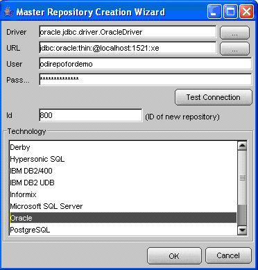

   Wait for the wizard to create the master repository.
 
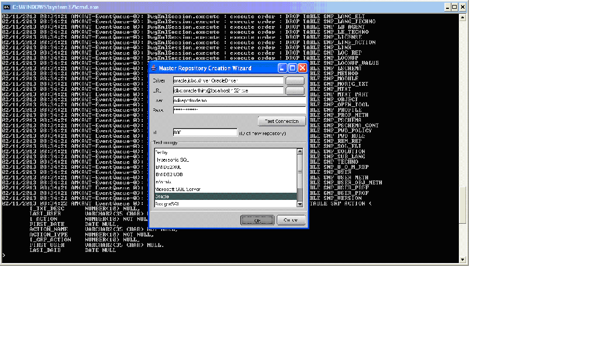

   Then click OK to exit the wizard when prompted

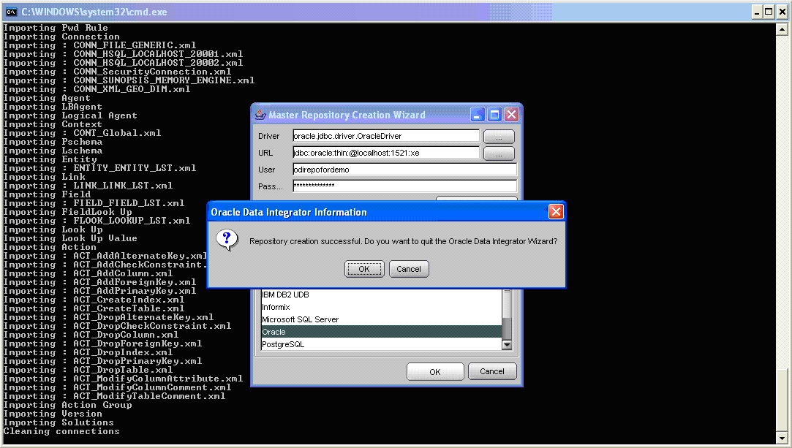
 
    Create a new master repository connection profile for the new master repository from Topology Manager (topology.bat).
    Use the default SUPERVISOR user (password "SUNOPSIS") 

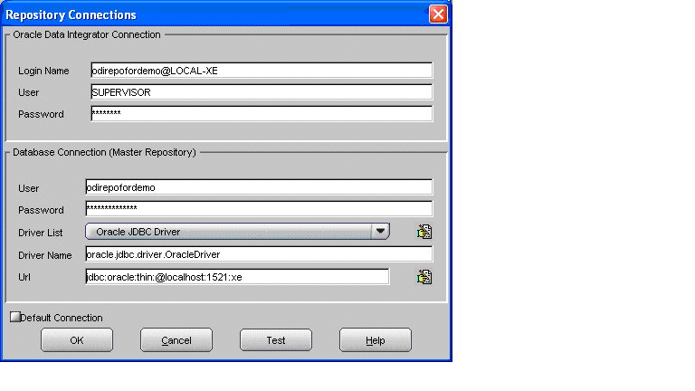

   Use the test function (Local agent) to check the entered details

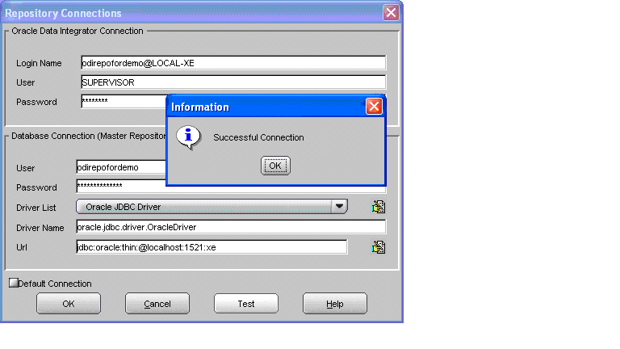

Create a new work repository in the same DB schema
--------------------------------------------------

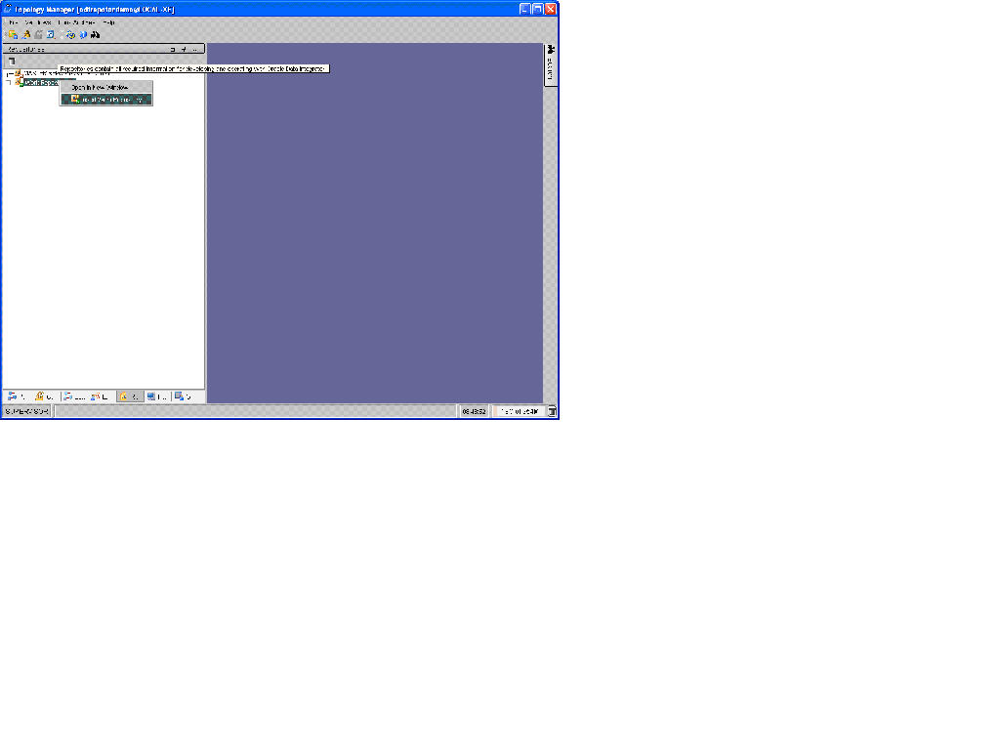

   Connect to the new master repository and create a new work repository from the
   Repositories tab by right-clicking on Work Repositories -> Insert Work Repository

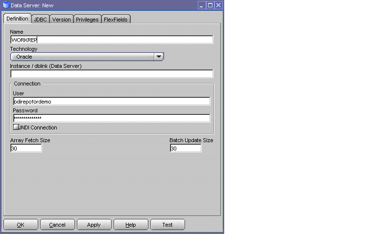

   Complete the "Definition" tab for the new work repository connection::

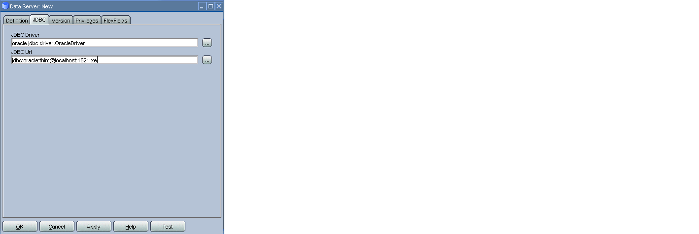

    Then complete the JDBC tab

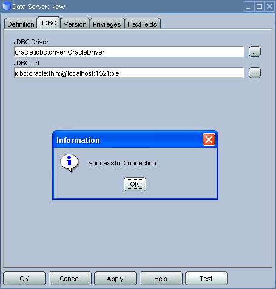

    Use the "Test" function, using the Local agent, to test the connection details for the work repository::

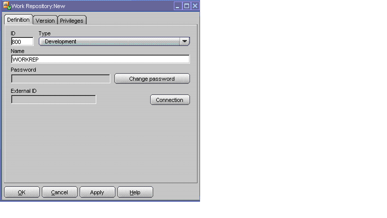

    Then enter the details of the new work repository. Ensure 800 is used at the internal ID::
    Click OK and a few seconds for the new work repository structure to be created.

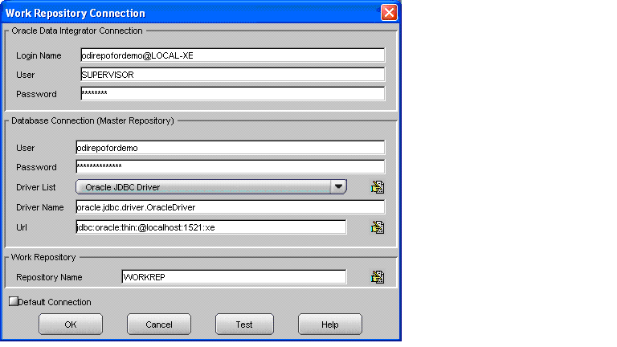

    Open the Designer UI from the toolbar icon in Topology Manager and create a new work repository connection profile for the new work repository::  

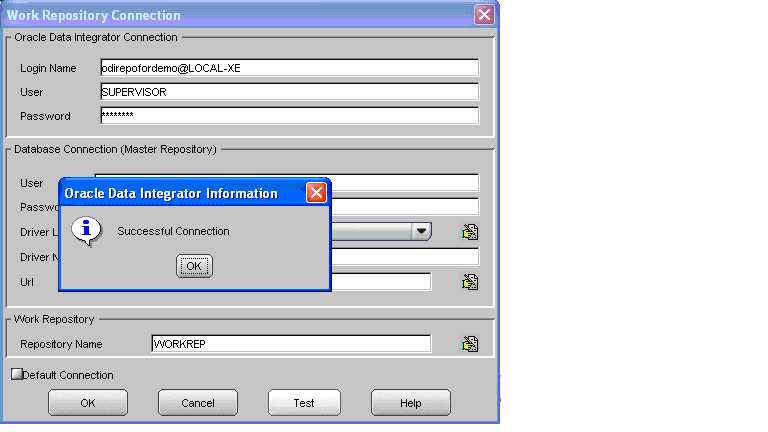

    Use the "Test" function, using the Local agent, to test the connection details for the work repository:: 
    You can now connect to the new, empty, work repository. Have a look. It’s empty!
 
Install and configure the ODI-SCM repository components
=======================================================

Set environment variables
-------------------------

Start a new Windows command prompt window (Start Menu -> Run… -> cmd.exe).

“CD” to the ODI home directory to use for this session. I.e. the directory containing the ODI “bin” directory (the ODI binaries). E.g.::

::

    cd /d C:\oracledi_fordemo1
    Set the ODI_HOME environment variable for this session::
    set ODI_HOME=%CD%

Configure “odiparams”
---------------------
“CD” to the ODI “bin” directory::
cd %ODI_HOME%\bin
Create the encoded representation of the master repository password for the new master repository by typing, at the command prompt. E.g.::
agent encode odirepofordemo
Set the repository connection details in the “odiparams.bat” file in the “bin” directory. Note that one might want to create a backup of your existing “odiparams.bat” file first. Alternatively one can ‘comment out’ the existing section and create a new copy of this section in the same file, immediately after the existing section, to override the environment variable settings with values for the new repository. 
Note that::
the entry in bold below is a custom entry required by the OdiScm mechanism::
the entry in blue is the encoded password string created using “agent encode…” command, above::

    rem
    rem Repository Connection Information
    rem
    set ODI_SECU_DRIVER=oracle.jdbc.driver.OracleDriver
    set ODI_SECU_URL=jdbc:oracle:thin:@localhost:1521:xe
    set ODI_SECU_USER=odirepofordemo
    set ODI_SECU_ENCODED_PASS=brfXH96Z5HtVgL5staMYzldCSb
    set ODI_SECU_PASS=odirepofordemo
    set ODI_SECU_WORK_REP=WORKREP
    set ODI_USER=SUPERVISOR
    set ODI_ENCODED_PASS=a7ypx6q1nhHGmAgO4acSJbMxp

Test the connection details, entered into the “odiparams.bat” file by running the command “agentscheduler.bat”. If the connection details have been correctly entered into the “odiparams.bat” file then you will see an error message indicating that an ODI agent
definition does not exist in the repository (i.e. the process was at least able to connect to the repository)

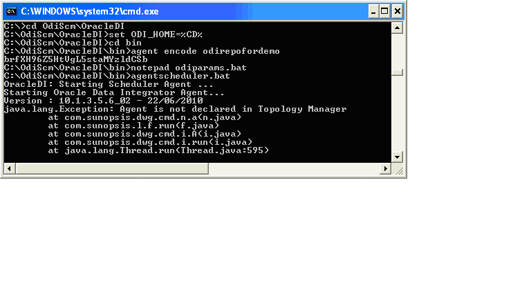

Import the ODI-SCM repository components
----------------------------------------

Run the following command to import the ODI code components of ODI-SCM  into the new repository::

    OdiScmImportOdiScm.bat NoExportPrime

.. figure:: imgs/5_3_0.png
 
Configure the ODI-SCM export mechanism
--------------------------------------

Master and Work repository connections
~~~~~~~~~~~~~~~~~~~~~~~~~~~~~~~~~~~~~~

Connect to the master repository with Topology Manager, and locate the following Data Servers in Physical Architecture -> Technologies -> Oracle::

   ODIMASTERREP_DATA
   ODIWORKREP_DATA

Edit the ODIMASTERREP_DATA data store to set the following fields::

Definition tab::

Instance – set to the master repository Oracle SID. E.g.::

	XE

User – set to the master repository database user name. E.g.::

	odirepofordemo

Password set to the master repository database user password. E.g.::

	odirepofordemo

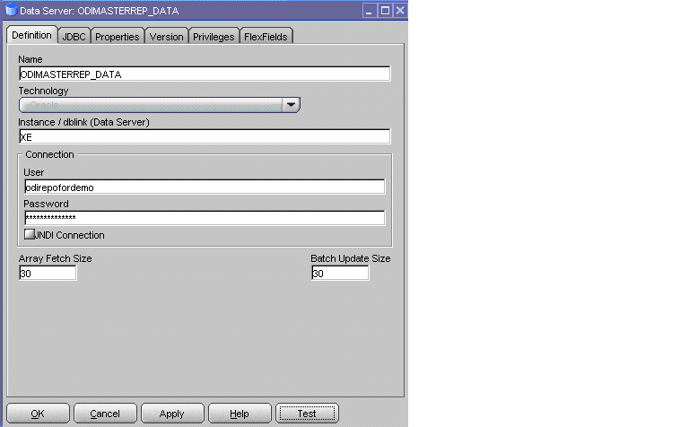

JDBC tab::

JDBC Driver – set to the Java class name of the JDBC driver . E.g.::

	oracle.jdbc.driver.OracleDriver

JDBC URL – set to the URL to connect to the database. E.g.::

	jdbc:oracle:thin:@localhost:1521:XE

Use the Test function to check the entered details::

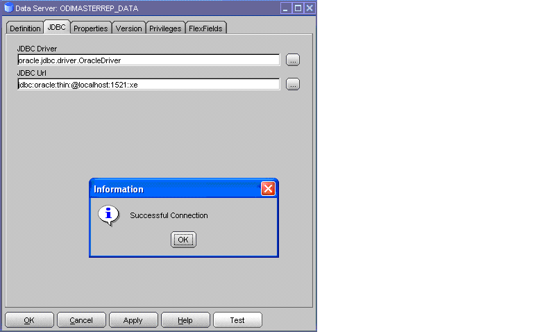
 
Under this Data Server edit the physical schema ``ODIMASTERREP_DATA.$DBUSER``::

On the definition tab set the field::

Schema (Schema)  – to the master repository user name. E.g.::

	Odirepofordemo

Schema (Work Schema) – to the master repository user name. E.g.::

	Odirepofordemo

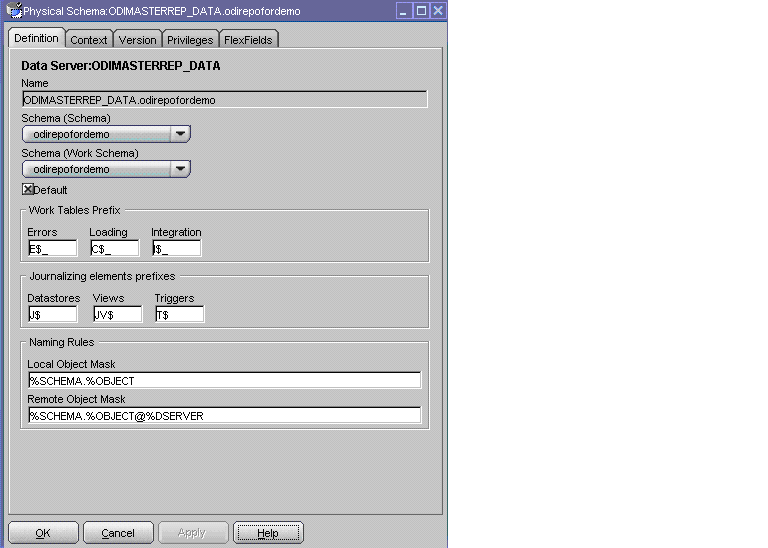

Edit the ODIWORKREP_DATA data store to set the following fields::

Definition tab::

Instance – set to the master repository Oracle SID. E.g.::

    XE

User – set to the work repository database user name. E.g.::

	odirepofordemo

Password set to the work repository database user password. E.g.::

	odirepofordemo

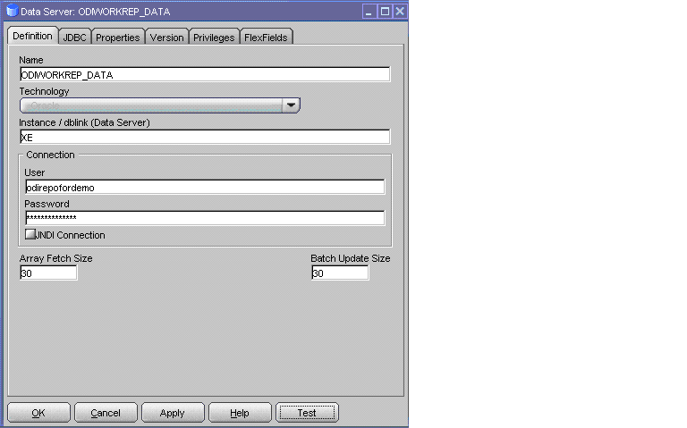

JDBC tab::

JDBC Driver – set to the Java class name of the JDBC driver . E.g.::

	oracle.jdbc.driver.OracleDriver

JDBC URL – set to the URL to connect to the database. E.g.::

    jdbc:oracle:thin:@localhost:1521:XE

.. figure:: imgs/5_41_4.png

   Use the Test function to check the entered details:

Under this Data Server edit the physical schema ``ODIMASTERREP_DATA.$DBUSER``
On the definition tab set the field:

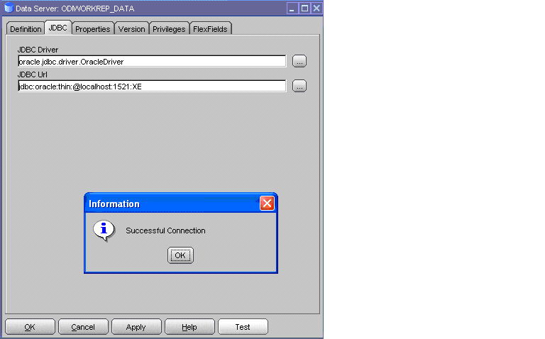

Schema (Schema)  – to the work repository user name. E.g.::

    Odirepofordemo

Schema (Work Schema) – to the master repository user name. E.g.::

    Odirepofordemo

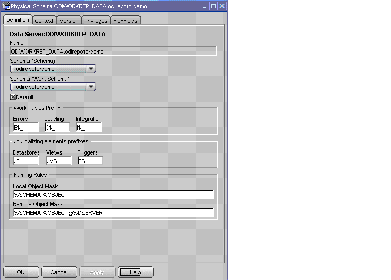

Working Copy File System
~~~~~~~~~~~~~~~~~~~~~~~~

Within Topology Manager locate the following Data Server in Physical Architecture -> Technologies -> File::

    ODISCMWC_DATA

Under this data server edit the physical schema ODISCMWC_DATA.WorkingCopyDir::

Overwrite “WorkingCopyDir” with the path to the SCM system working copy. E.g.::

    C:/DemoSvnWc/DemoSvnRepo

Overwrite “WorkingDir” with the path a file system directory where temporary files can be created/deleted by the ODI-SCM mechanism. E.g::

    C:/Temp

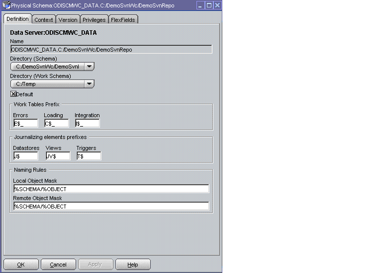
 
Logical to Physical Schema Mappings
~~~~~~~~~~~~~~~~~~~~~~~~~~~~~~~~~~~

.. XXX - convert to tables

Finally, within Topology Manager, set up the GLOBAL context schema mappings from the Contexts tab:

==================    =================================================
Logical Schema        Physical Schema
==================    =================================================
ODIMASTERREP_DATA	  ODIMASTERREP_DATA.<your master repo schema name>
==================    =================================================

==================    =================================================
Logical Schema        Physical Schema
==================    =================================================
ODIWORKREP_DATA	      ODIWORKREP_DATA.<your work repo schema name>
==================    =================================================

==================    =================================================
Logical Schema        Physical Schema
==================    =================================================
ODISCMWC_DATA	      ODISCMWC_DATA.<your working copy directory>
==================    =================================================

e.g.::

   ODISCMWC_DATA.C:/DemoSvnWc/DemoSvnRepo

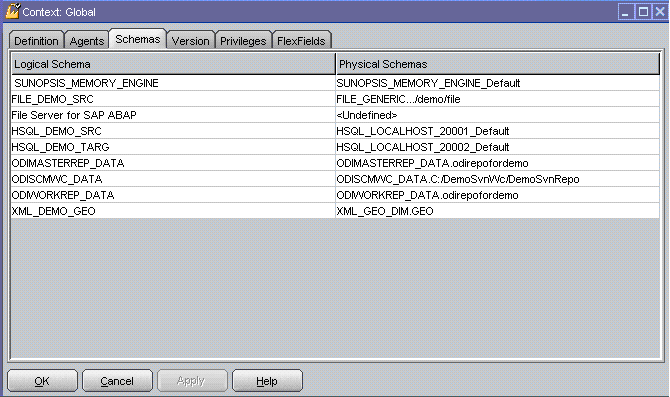

Version Control System
----------------------

Within the Designer UI, navigate to the ODI-SCM project, navigate to Variables. Change the following variables’ defaut values::

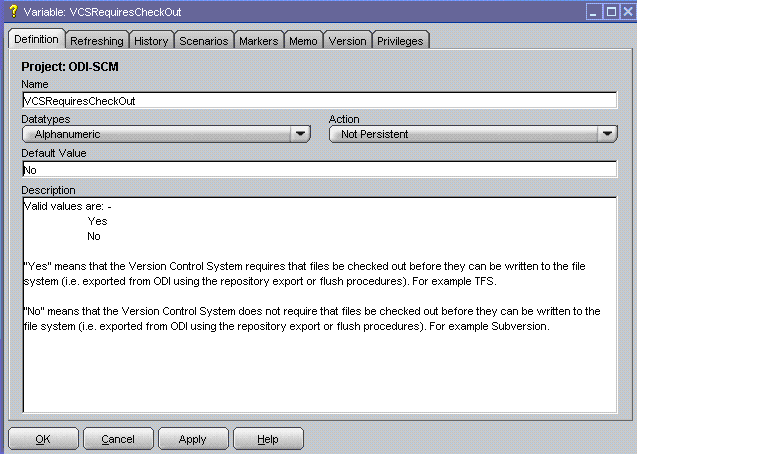

    VCSRequiresCheckOut	- from “Yes” to “No”.

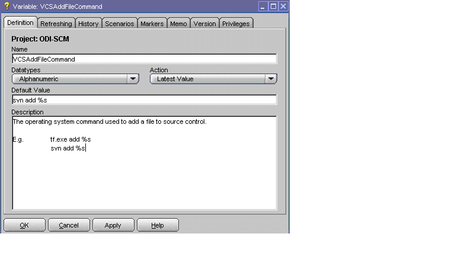
 
    VCSAddFileCommand – from “tf.exe add %s /lock:none” to “svn add %s --force”.

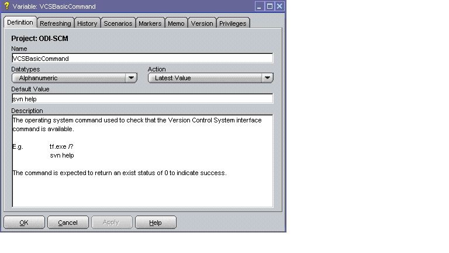

    VCSBasicCommand – from “tf.exe /?” to “svn help”.

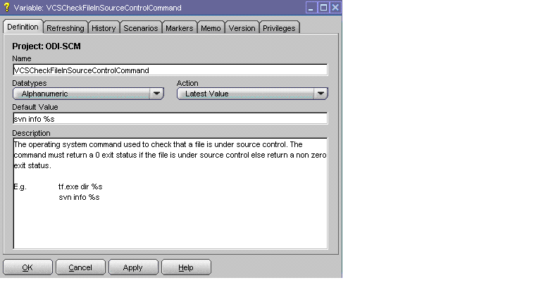

    VCSCheckFileInSourceControlCommand – from “tf.exe dir %s” to “svn info %s”.

 
Prime export mechanism
----------------------

Run the following command to prime the export ‘control’ metadata::

    OdiScmJisqlRepo.bat %ODI_SCM_HOME%\Configuration\Scripts\OdiScmPrimeExportNow.sql
 
Import the standard ODI demo 
============================

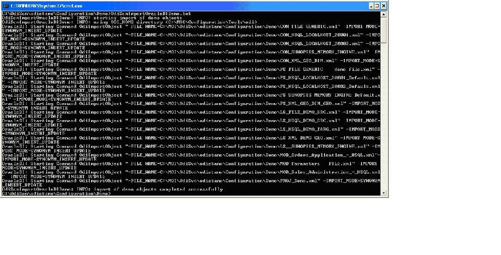

“CD” to the “Demo” directory of the OdiScm directory tree. E.g.::

    cd /d %ODI_SCM_HOME%\Configuration\Demo

Run the script to import the standard ODI demo project and models
(extracted from the standard ODI HSQL demo repository) into the new work repository:: 

    OdiScmImportOracleDIDemo.bat

The following output should be seen::
	 

Refresh the Projects and Models views in Designer, and the Logical Architecture and
Physical Architecture view in Topology Manager, and the standard ODI demo material will now be visible.
 
Add ODI-SCM custom markers
==========================

Create new Marker Group and Marker in Demo project
--------------------------------------------------

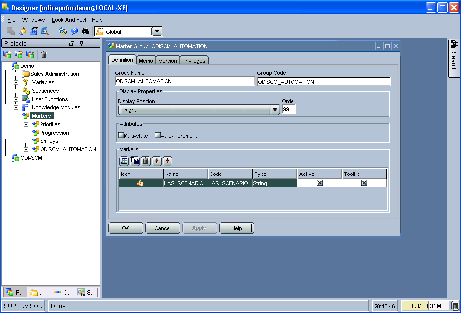

Create a new Marker Group, in the Demo project, with name and code set to “ODISCM_AUTOMATION” and Order set to “99”.
In this new group, create a new marker with name and code set to “HAS_SCENARIO” and an icon of the ‘Thumbs Up’ image.
 
Apply new Marker to objects in the Demo project
-----------------------------------------------

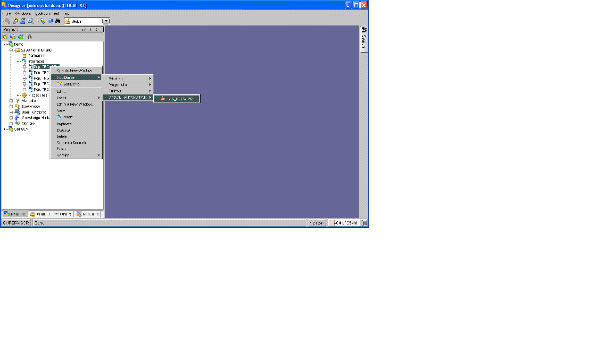

Apply the new HAS_SCENARIO marker to each and every Interface and Procedure in the “Sales Administration” folder in the Demo project. E.g.:
When applied to all objects you’ll see this (as long as the “Display markers and memo flags” is turned on, on the “Windows” menu):

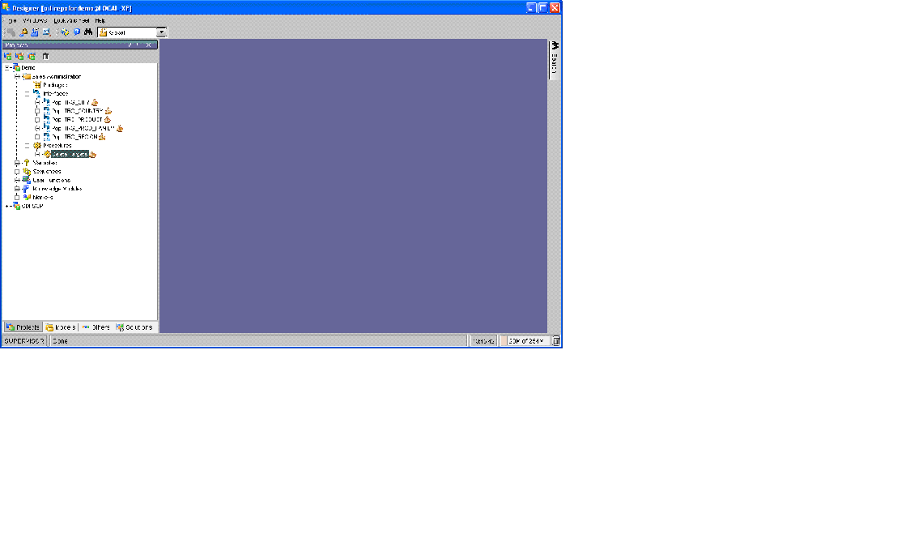

Create a new empty Subversion repository and working copy
---------------------------------------------------------

New SVN repository
------------------

Create a new file based SVN repository. E.g.::

    svnadmin create C:\DemoSvnRepo

New Working Copy
----------------

Create a new working copy directory. E.g.::

    mkdir C:\DemoSvnWc
    cd C:\DemoSvnWc
    svn checkout file:///C:/DemoSvnRepo

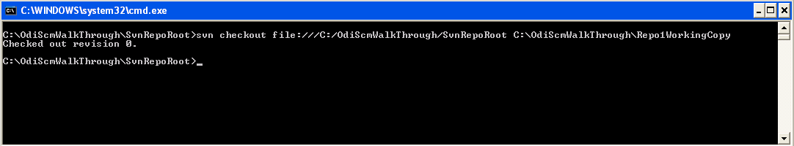

 
Export the standard ODI demo and check into SVN
-----------------------------------------------

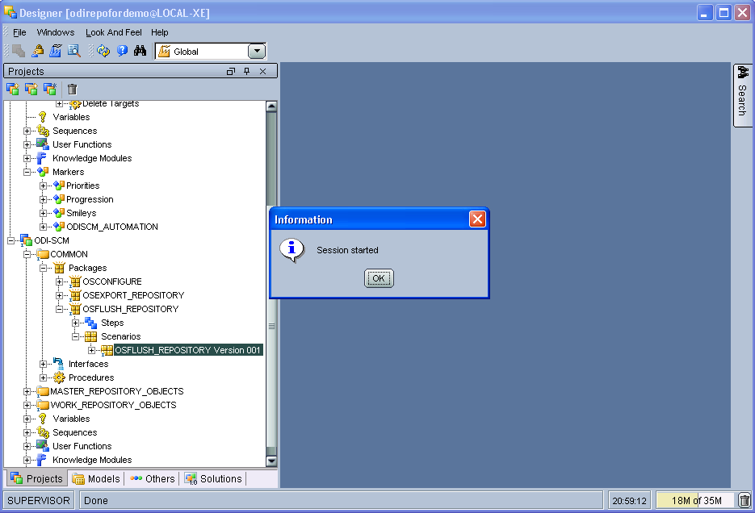

‘Flush’ changes in the repository to the SVN working copy
From within the Designer UI navigate to::

    Projects -> ODI-SCM -> COMMON -> Packages -> OSFLUSH_REPOSITORY

Right-click on the Scenario for the package OSUTL_FLUSH_REPOSITORY -> Execute, selecting the Global context and the Local agent.
 
Monitor the session in the Operator UI::

  fig

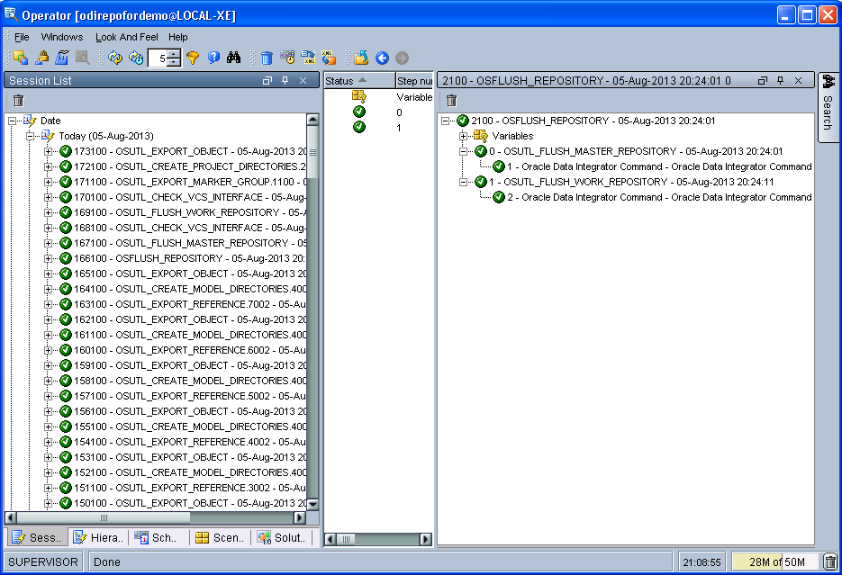

Note the step “Create Flush Control” that failed with a warning message.
The ‘flush control’ table was created by the ODI-SCM demo import script. It’s safe to ignore this warning.

Check in the exported code to the SVN repository
------------------------------------------------

From the command prompt “CD” to the SVN working copy directory corresponding to the SVN repository root directory. E.g.::

    cd  C:\DemoSvnWc\DemoSvnRepo

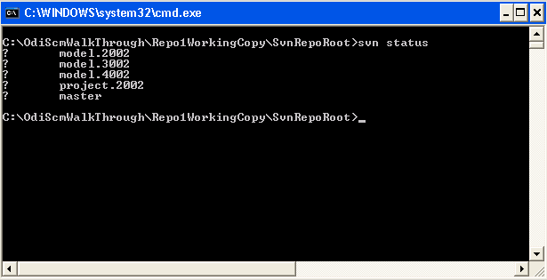

Examine the status of the working copy using the command “svn status”. E.g::

    fig

Mark all files created by the ODI-SCM export mechanism to be added to the repository::

    svn add . –force

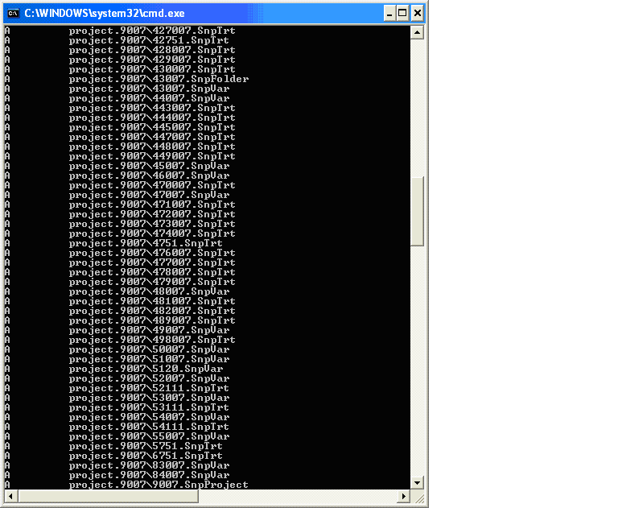

(Note that “—force” is used to add all files in all subdirectories).
 
Commit the files to the SVN repository. E.g.::

    svn commit –m “Initial checkin of the standard ODI demo”

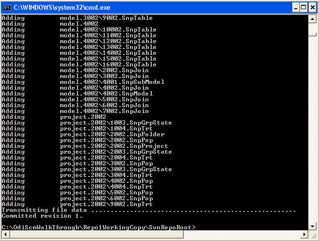

Note that now the SVN repository also contains a copy of the ODI-SCM export components
with the version control system configuration options (‘requires checkout?’, etc) set, earlier.
This copy of the ODI-SCM code can then be imported into other repositories via the version control
system and the ODI-SCM import process. See the next stage of this walk through.
 
Build a second ODI repository from SVN
--------------------------------------

Create a second new Oracle user using the same process as the first. E.g. with user name “odirepo2fordemo”::

    create user odirepo2fordemo identified by odirepo2fordemo default tablespace users temporary tablespace temp;
    grant connect, resource to odirepo2fordemo;

Create a second master repository in this schema with a different internal ID. E.g. 801.
Create a second work repository, with name WORKREP, in the new schema (again, the same schema as the master repository) with a different internal ID to the first. E.g. 801.
Create a second working copy of the SVN repository based on the initial empty repository revision. I.e. don’t get any files from the repository.  E.g.::

    mkdir C:\DemoSvnWc2
    cd C:\DemoSvnWc2
    svn checkout file:///C:/DemoSvnRepo --revision 0

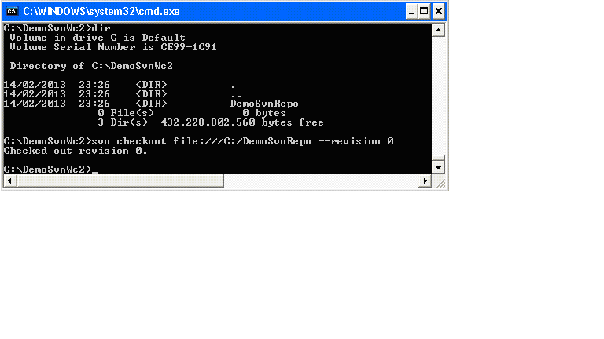

Create a plain (ASCII) text format INI file named “OdiScm.ini” file for the ODI-SCM import mechanism in the working copy root. E.g. in::

    C:\DemoSvnWc2\DemoSvnRepo.

For example::

    [OracleDI]
    ODI_HOME=C:\OdiScm\odietamo\oracledi
    ODI_JAVA_HOME=C:\Program Files\Java\jdk1.5.0_22
    [SCMSystem]
    SCMSystemTypeName=SVN
    SCMSystemURL=file:///C:/DemoSvnRepo
    SCMBranchURL=.
    [Tools]
    JAVA_HOME= C:\Program Files\Java\jdk1.6.0_29
    ODI_SCM_JISQL_HOME=C:\jisql-2.0.11

Note that a full INI file (other ODI-SCM processes add additional sections and keys) has the following sections and keys::

    [OracleDI]
    ODI_HOME=<Home directory of ODI>
    ODI_JAVA_HOME=<Home directory of JVM to use with ODI>
    ; Optional entries to override repository connection details
    ; stored in odiparams.bat in the ODI bin directory.
    ODI_SECU_DRIVER=<JDBC driver class for ODI repository connection>
    ODI_SECU_URL=<JDBC URL for ODI repository connection>
    ODI_SECU_USER=<master ODI repo DB user/owner name>
    ODI_SECU_ENCODED_PASS=<master ODI repo DB user/owner  encoded password>
    ODI_SECU_PASS=<master ODI repo DB user/owner>
    ODI_SECU_WORK_REP=<ODI work repo name. Always “WORKREP” for ODI-SCM>
    ODI_USER=<ODI user name>
    ODI_ENCODED_PASS=< ODI user encoded password >
    [SCMSystem]
    SCMSystemTypeName=<SVN | TFS>
    SCMSystemURL=<Version Control System repo root URL>
    SCMBranchURL=<Version Control System code path>
    ; Optional SCM system login details.
    SCMUserName=<[domain\]user>
    SCMUserPassword=<password>
    [TFS]
    ; Optional ‘TFS specific’ section to specify a user with access to all ChangeSets.
    TFSGlobalUserName=<[domain\]user>
    TFSGlobalUserPassword=<password>
    [Tools]
    JAVA_HOME=<Home directory of JVM to use with Jisql>
    ODI_SCM_JISQL_HOME=<Home directory of jIsql>
     [ImportControls]
    ; This section tracks the versions from the SCM system applied.
    OracleDIImportedRevision=<Highest version import into ODI repo>
    WorkingCopyRevision=<Highest version applied to working copy>

Download the code and generate the ODI import script using the command::

    OdiScmGet.bat

